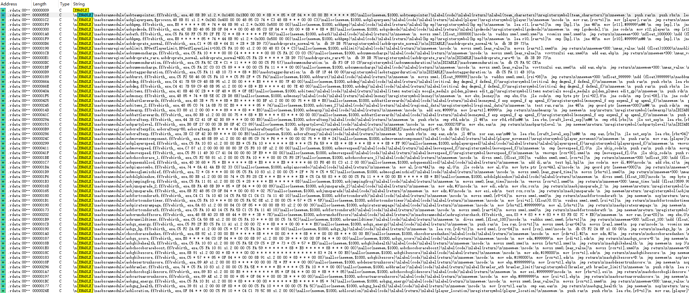

# 2026-01-30
风灵月影没有做任何保护，exe拖入ida即可看到明文字符串。
搜索字符串"[ENABLE]"即可得到所有CE AA脚本。

[money](money.md)

[health](health.md)

只是做完这两个数据的修改，体验了CE的内存访问断点，从数据反推代码段的方式太爽了。

对比之前做PUBG和三角洲逆向，只能做静态分析，被静态分析恶心坏了，CE动态分析的爽实在是爽。

我根本不需要做UE4 Dump，就可以直接定位到数据对应的代码，而且还能通过直接patch代码的方式改数据，太爽了，难度降低了一个数量级。

在PUBG里，我都无法通过patch代码读数据，更不用说改数据，一改代码就会被反作弊抓住。

