# 2026-02-02 
## 先注册

初步确定是C#和WebView实现的UI。

## 功能无法启用
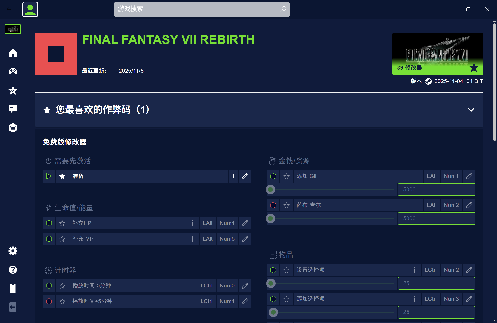
运行游戏，点准备，完全没反应。

## TrainerLib_x64.dll
x64dbg附加，查看模块列表，看到了熟悉的名称。
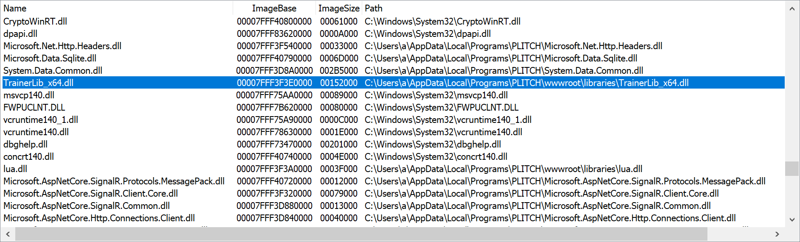
不错，正是WeMod的TrainerLib_x64.dll，先确定一下是不是同一个文件吧。

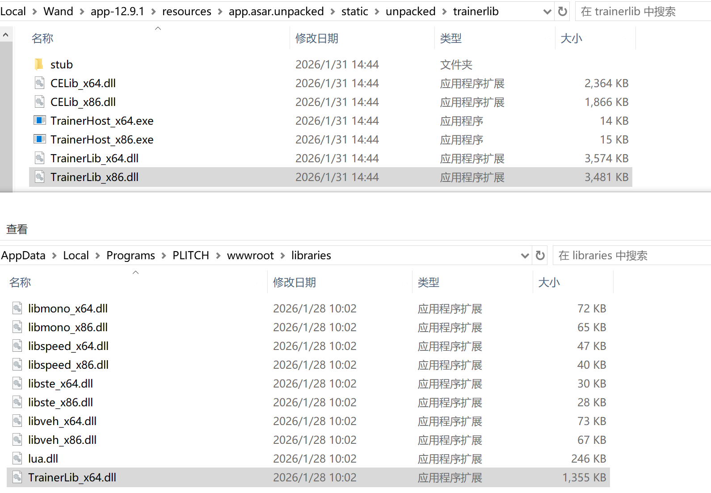
有个大一个小，但是WeMod有加壳，它这个可能没加壳才更小。

拖入到DIE，果然，它这个没有加壳。

换个游戏，启动最后生还者2，它的功能就可以激活了。
说明FF7Rebirth无法启用功能的确是它的Bug。

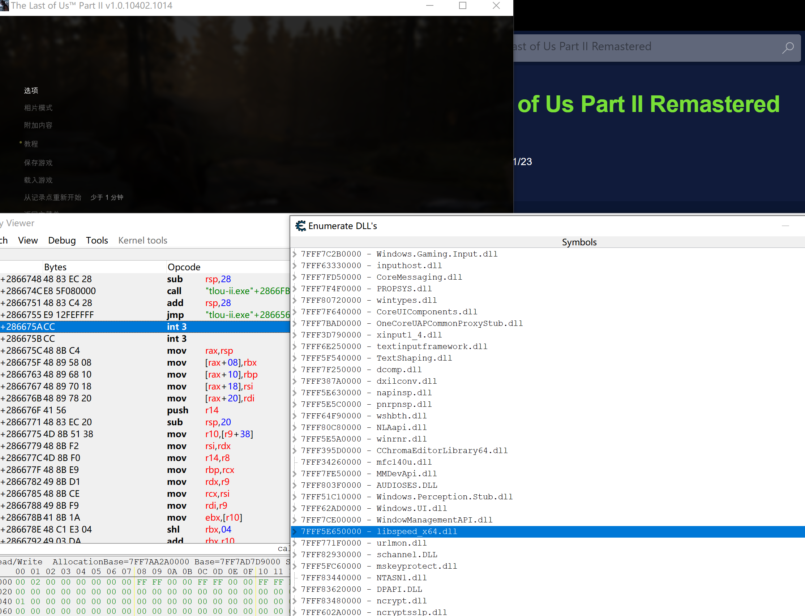

和WeMod不同，这次没有看到游戏修改特有的dll，只找到了libspeed.dll，应该是speedhack用的。

## ENABLE
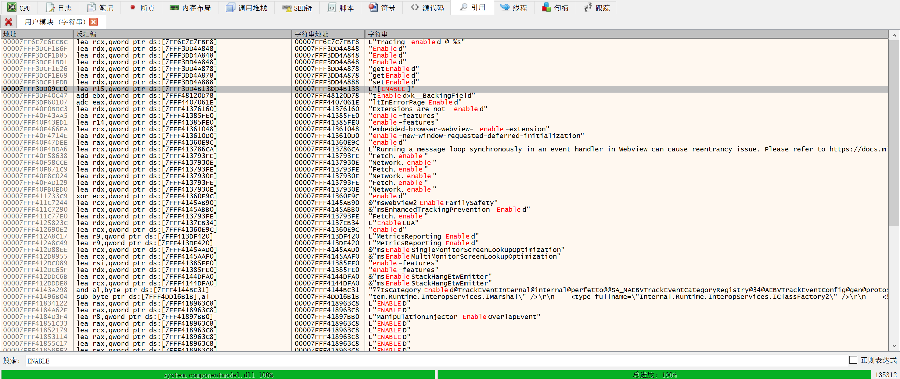
故技重施，搜索ENABLE，试图找到AA脚本，但是找不到了。

很可能没有AA源码了，内存中只有AA脚本编译后的东西了。

## <trainerlib_x64.ExecuteCheat>
这个断点每次开关作弊按钮，都会触发。

它的r8参数，是一个C#层的回调函数。

C#我不熟，是否要逆向到C#层？如果在C#层也没有AA源码，那么追到C#层意义不大。

在WeMod中，AA脚本是源码，然后可能是通过CELib_x64.dll编译后，再调用TrainerLib_x64.dll去执行。

而这个修改器不一样，没有CELib_x64.dll，我也没找到AA源码。
我猜测，它就是只有AA源码编译后的二进制数据，然后直接把二进制数据丢给TrainerLib_x64.dll，这样就隐藏了AA源码，防止被直接窃取最重要的AA源码，非常聪明。
要从AA源码编译后的产物，去还原为AA源码，才能窃取它的游戏逆向成果，逆向成本大大增加了。

## WriteProcessMemory
```c
BOOL WriteProcessMemory(
  [in]  HANDLE  hProcess,
  [in]  LPVOID  lpBaseAddress,
  [in]  LPCVOID lpBuffer,
  [in]  SIZE_T  nSize,
  [out] SIZE_T  *lpNumberOfBytesWritten
);
```
从其行为进行分析。断这个它修改游戏进程会调用的函数。

### 第一个

RAX : 000000723447EE38
RBX : 0000000000002338
RCX : 0000000000002338
RDX : 000001C5442B0000
RBP : 000000723447EF00
RSP : 000000723447EDF8     &"吚t/H億$8"
RSI : 000000723447F000
RDI : 000001C5442B0000
R8  : 000000723447F000
R9  : 0000000000000008
R10 : 0000000000000000
R11 : 0000000000000246     L'Ɇ'
R12 : 00007FF7ADADC3EC
R13 : 0000000000000000
R14 : 0000000000000000
R15 : 0000000000000008
RIP : 00007FFF83AE2AC0     <kernelbase.WriteProcessMemory>

游戏进程：
lpBaseAddress: 000001C5442B0000 EC C3 AD AD F7 7F 00 00

修改器进程
lpBuffer: 000000723447F000  EC C3 AD AD F7 7F 00 00 35 33 38 32 34 00 00 00  ìÃ..÷...53824...  

可见，的确是写了8字节数据到游戏进程。那么这个数据是啥呢？

看上去是一个地址，游戏进程此地址的数据：

00007FF7ADADC3EC: 00 00 00 00 00 00 00 00 00 00 00 00 00 00 00 00 00 00 00 00 00 00 00 00 00 00 00 00 00 00 00 00

全是零。
### 第二个
RAX : 000000723417EB80
RBX : 0000000000000025     '%'
RCX : 0000000000002338
RDX : 000001C544360000
RBP : 000000723417F350
RSP : 000000723417CB48
RSI : 000001C544360000
RDI : 000001CE39E0C500
R8  : 000001CE3A89D000
R9  : 0000000000000025     '%'
R10 : 0000000000000000
R11 : 0000000000000246     L'Ɇ'
R12 : 0000000000002338
R13 : 000001CE431A4650
R14 : 000001CE39E0C520
R15 : 000001CE431A4650
RIP : 00007FFF83AE2AC0     <kernelbase.WriteProcessMemory>

000001CE3A89D000  48 83 EC 28 F3 0F 10 05 15 00 00 00 FF 15 02 00  H.ì(ó.......ÿ...  

很明显，这是代码。

游戏进程：
```
1C544360000 - 48 83 EC 28           - sub rsp,28 { 40 }
1C544360004 - F3 0F10 05 15000000   - movss xmm0,[1C544360021] { (1.00) }
1C54436000C - FF15 02000000 EB08 C0162978FF7F0000 - call libspeed_x64.SpeedhackSetSpeed
1C54436001C - 48 83 C4 28           - add rsp,28 { 40 }
1C544360020 - C3                    - ret 
```
是在给游戏进程写一个调用SpeedhackSetSpeed的函数。

## 如果目标是找到调用TrainerLib_x64.dll的方式
那么WeMod有AA源码，从它下手，更可能追溯到调用方式。这两个修改器的TrainerLib_x64大概率是同样的，都是CE生态下的东西。

所以，还是回到WeMod，看它怎么把AA源码编译为二进制数据，再把二进制数据传递给TrainerLib_x64，是一个更好的路径。

## WeMod论坛
https://community.wemod.com/t/what-dll-is-responsible-for-injecting-trainers-into-the-games-exe/245253

技术人员回帖了：
```
CELib_x64.dll is required to assemble scripts. 
TrainerLib_x64.dll is in charge of loading that and the trainer DLL (the one with the random file name).
A separate process injects and executes TrainerLib to bootstrap it all.``
```
可见啊，我猜测是对的。不过早点看到这帖子就好了。

plitch修改器根本就没有用CeLib，可见AA是编译后下发的二进制，本地没有AA源码。所以直接逆这货多少是个死路。还好我先逆了wemod，不会走到死胡同里去。

那么到底，TrainerLib的原作者是谁？查看WeMod目录下其数字签名，是WeMod LLC。
而这修改器目录下，其数字签名是MegaDev GmbH。
哈哈，原版作者到底是谁？

## 回到FF7Rebirth和WeMod
运行游戏和WeMod，x64dbg附加游戏进程，因为WeMod的方案是直接把修改器dll注入到游戏进程中，而不是通过WriteProcessMemmory来修改内存，性能更高。

RAX : 0000000110001B90     <celib_x64.WeMod_2>
RBX : 0000021A39A07250
RCX : 0000021A3AF41310     "fort_condor_infinite_atb"
RDX : 0000021A3AF41310     "fort_condor_infinite_atb"
RBP : 0000000000000000
RSP : 000000FCCC7BFC88
RSI : 0000021A3A1C8A80
RDI : 0000021A39A07270     &"fort_condor_infinite_atb"
R8  : 00000000FFFFFFFF
R9  : 0000000000000001
R10 : 0000021A461A0000
R11 : 000000FCCC7BFC40
R12 : 0000000000000000
R13 : 0000000000000000
R14 : 0000000000000000
R15 : 0000000000000000
RIP : 0000000110001B90     <celib_x64.WeMod_2>

发现WeMod的TrainerLib会调用CeLib，而且直接把AA源码字符串作为参数。而PLITCH的TrainerLib根本就没有AA源码，可见两者不一样。

TrainerLib只是同名，给我误导了。

深度逆向WeMod的CeLib和TrainerLib是否有必要？真正有价值的只是AA源码，而不是这些dll本身，深度逆向这两个dll，还不如自己实现快。

因为Cheat Engine是开源的，根本就不需要逆向，直接正向开发，提取其中的AA模块出来即可，真正需要的也就只有这个AA模块，甚至这个都可以不要，全自己实现。

PLITCH的AA源码没有分发到本地，要还原为AA源码可能非常难，那么直接取出其二进制参数，不还原为AA源码，可行吗？

但是不还原就无法修改，无法维护，那还玩个毛啊。

## 再回到PLITCH看看
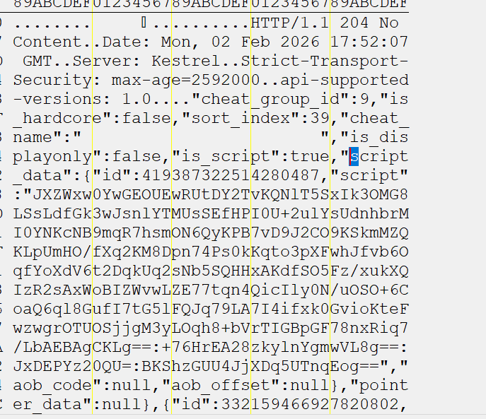
用CE搜索字符串aob，反而给搜到线索了。AA不是没有源码，而是加密了。

0000023CCC1684D3  48 03 F4 4E 16 E5 36 6E 74 0D 0A 44 61 74 65 3A  H.ôN.å6nt..Date:  
0000023CCC1684E3  20 4D 6F 6E 2C 20 30 32 20 46 65 62 20 32 30 32   Mon, 02 Feb 202  
0000023CCC1684F3  36 20 31 38 3A 35 35 3A 32 30 20 47 4D 54 0D 0A  6 18:55:20 GMT..  
0000023CCC168503  53 65 72 76 65 72 3A 20 4B 65 73 74 72 65 6C 0D  Server: Kestrel.  
0000023CCC168513  0A 53 74 72 69 63 74 2D 54 72 61 6E 73 70 6F 72  .Strict-Transpor  
0000023CCC168523  74 2D 53 65 63 75 72 69 74 79 3A 20 6D 61 78 2D  t-Security: max-  
0000023CCC168533  61 67 65 3D 32 35 39 32 30 30 30 0D 0A 61 70 69  age=2592000..api  
0000023CCC168543  2D 73 75 70 70 6F 72 74 65 64 2D 76 65 72 73 69  -supported-versi  
0000023CCC168553  6F 6E 73 3A 20 31 2E 30 0D 0A 0D 0A AE DE 35 08  ons: 1.0....®Þ5.  
0000023CCC168563  76 4B 87 6D 0E 1D 41 A1 A5 F9 1E CF 54 72 61 6E  vK.m..A¡¥ù.ÏTran  
0000023CCC168573  73 70 6F 72 74 2D 53 65 63 75 72 69 74 79 3A 20  sport-Security:   
0000023CCC168583  6D 61 78 2D 61 67 65 3D 32 35 39 32 30 30 30 0D  max-age=2592000.  
0000023CCC168593  0A 61 70 69 2D 73 75 70 70 6F 72 74 65 64 2D 76  .api-supported-v  
0000023CCC1685A3  65 72 73 69 6F 6E 73 3A 20 31 2E 30 0D 0A 0D 0A  ersions: 1.0....  
0000023CCC1685B3  66 30 36 0D 0A 7B 22 63 68 65 61 74 73 22 3A 5B  f06..{"cheats":[  
0000023CCC1685C3  7B 22 69 64 22 3A 33 33 31 38 36 39 37 32 33 35  {"id":3318697235  
0000023CCC1685D3  38 35 34 31 37 32 31 36 2C 22 69 6E 63 6F 6D 70  85417216,"incomp  
0000023CCC1685E3  61 74 69 62 6C 65 5F 69 64 22 3A 30 2C 22 68 6F  atible_id":0,"ho  
0000023CCC1685F3  74 6B 65 79 22 3A 6E 75 6C 6C 2C 22 64 65 73 63  tkey":null,"desc  
0000023CCC168603  72 69 70 74 69 6F 6E 22 3A 6E 75 6C 6C 2C 22 73  ription":null,"s  
0000023CCC168613  74 61 74 75 73 22 3A 32 2C 22 64 65 70 65 6E 64  tatus":2,"depend  
0000023CCC168623  73 5F 6F 6E 5F 69 64 22 3A 6E 75 6C 6C 2C 22 63  s_on_id":null,"c  
0000023CCC168633  68 65 61 74 5F 67 72 6F 75 70 5F 69 64 22 3A 37  heat_group_id":7  
0000023CCC168643  2C 22 69 73 5F 68 61 72 64 63 6F 72 65 22 3A 66  ,"is_hardcore":f  
0000023CCC168653  61 6C 73 65 2C 22 73 6F 72 74 5F 69 6E 64 65 78  alse,"sort_index  
0000023CCC168663  22 3A 31 38 2C 22 63 68 65 61 74 5F 6E 61 6D 65  ":18,"cheat_name  
0000023CCC168673  22 3A 22 5C 22 50 72 65 70 61 72 65 3A 20 67 65  ":"\"Prepare: ge  
0000023CCC168683  74 20 70 6C 61 79 65 72 20 28 68 65 61 6C 74 68  t player (health  
0000023CCC168693  29 5C 22 22 2C 22 69 73 5F 64 69 73 70 6C 61 79  )\"","is_display  
0000023CCC1686A3  6F 6E 6C 79 22 3A 66 61 6C 73 65 2C 22 69 73 5F  only":false,"is_  
0000023CCC1686B3  73 63 72 69 70 74 22 3A 74 72 75 65 2C 22 73 63  script":true,"sc  
0000023CCC1686C3  72 69 70 74 5F 64 61 74 61 22 3A 7B 22 69 64 22  ript_data":{"id"  
0000023CCC1686D3  3A 34 31 39 33 38 37 33 32 32 35 31 34 32 38 30  :419387322514280  
0000023CCC1686E3  34 36 36 2C 22 73 63 72 69 70 74 22 3A 22 58 36  466,"script":"X6  
0000023CCC1686F3  63 59 53 4E 39 31 76 35 43 54 46 4E 44 50 78 68  cYSN91v5CTFNDPxh  
0000023CCC168703  6F 6D 45 43 45 71 41 76 78 74 53 7A 78 34 6A 2F  omECEqAvxtSzx4j/  
0000023CCC168713  76 35 44 6D 4B 73 4D 32 4C 55 46 69 65 79 58 6B  v5DmKsM2LUFieyXk  
0000023CCC168723  5A 4B 62 74 79 2B 51 55 33 50 39 48 47 37 69 62  ZKbty+QU3P9HG7ib  
0000023CCC168733  34 71 30 56 50 6B 39 70 2F 36 2B 54 70 31 52 50  4q0VPk9p/6+Tp1RP  
0000023CCC168743  46 66 63 4E 31 6D 47 54 46 6A 76 54 6C 33 6B 55  FfcN1mGTFjvTl3kU  
0000023CCC168753  71 51 48 2B 70 47 67 57 39 64 43 64 74 72 43 44  qQH+pGgW9dCdtrCD  
0000023CCC168763  43 45 37 4D 49 6A 6B 59 6E 70 75 4D 49 51 51 49  CE7MIjkYnpuMIQQI  
0000023CCC168773  59 78 7A 4D 4D 57 37 48 53 57 49 6F 6C 73 5A 43  YxzMMW7HSWIolsZC  
0000023CCC168783  75 48 48 48 47 76 33 75 58 7A 69 59 69 48 7A 51  uHHHGv3uXziYiHzQ  
0000023CCC168793  71 46 59 50 58 4E 61 6A 59 31 75 57 4A 65 73 49  qFYPXNajY1uWJesI  
0000023CCC1687A3  6D 79 6D 38 4A 47 30 31 45 6E 39 72 53 61 44 4E  mym8JG01En9rSaDN  
0000023CCC1687B3  78 4D 64 78 4E 59 6D 4A 53 5A 67 59 63 42 78 54  xMdxNYmJSZgYcBxT  
0000023CCC1687C3  74 66 46 63 44 6A 61 51 62 36 38 67 35 43 73 6B  tfFcDjaQb68g5Csk  
0000023CCC1687D3  74 30 4E 61 51 74 34 62 42 6B 47 76 5A 42 6A 63  t0NaQt4bBkGvZBjc  
0000023CCC1687E3  43 79 70 32 63 43 43 57 6D 37 30 64 6B 63 73 63  Cyp2cCCWm70dkcsc  
0000023CCC1687F3  6E 43 72 79 51 4B 5A 50 69 70 65 6B 73 50 73 53  nCryQKZPipeksPsS  
0000023CCC168803  47 69 4C 4C 65 6E 6A 4B 33 6F 52 6B 41 74 6E 54  GiLLenjK3oRkAtnT  
0000023CCC168813  33 6B 4D 65 4F 59 6B 71 76 75 53 41 54 76 4D 2B  3kMeOYkqvuSATvM+  
0000023CCC168823  71 73 47 33 44 47 62 45 70 41 31 51 64 43 6D 61  qsG3DGbEpA1QdCma  
0000023CCC168833  62 46 41 55 33 64 56 62 78 64 33 62 52 6C 70 50  bFAU3dVbxd3bRlpP  
0000023CCC168843  73 48 7A 68 73 51 6F 74 58 39 75 2F 78 62 75 50  sHzhsQotX9u/xbuP  
0000023CCC168853  56 6A 50 67 68 61 43 56 4D 65 65 45 75 71 75 57  VjPghaCVMeeEuquW  
0000023CCC168863  48 69 66 6D 59 4C 57 50 6E 6A 54 6B 62 36 58 38  HifmYLWPnjTkb6X8  
0000023CCC168873  35 58 30 38 44 69 45 66 54 43 43 55 32 45 35 45  5X08DiEfTCCU2E5E  
0000023CCC168883  72 45 55 6D 43 78 32 2B 71 50 75 78 48 49 74 62  rEUmCx2+qPuxHItb  
0000023CCC168893  79 46 6D 57 53 6E 78 33 4A 6F 32 49 50 62 69 48  yFmWSnx3Jo2IPbiH  
0000023CCC1688A3  31 31 75 57 51 4E 70 37 51 78 32 59 49 77 57 69  11uWQNp7Qx2YIwWi  
0000023CCC1688B3  64 33 47 4B 6B 69 35 49 44 49 37 6F 67 43 33 62  d3GKki5IDI7ogC3b  
0000023CCC1688C3  2F 79 4F 32 49 6F 33 54 35 32 4C 66 66 68 54 61  /yO2Io3T52LffhTa  
0000023CCC1688D3  66 35 70 36 6C 30 6F 50 76 76 59 63 48 30 6A 48  f5p6l0oPvvYcH0jH  
0000023CCC1688E3  43 5A 33 66 6D 4A 79 38 38 72 55 76 5A 38 49 62  CZ3fmJy88rUvZ8Ib  
0000023CCC1688F3  79 6A 57 54 4E 59 77 4B 42 4B 71 73 71 6A 5A 49  yjWTNYwKBKqsqjZI  
0000023CCC168903  59 4C 61 35 4B 34 47 4A 46 46 4E 56 59 43 59 49  YLa5K4GJFFNVYCYI  
0000023CCC168913  73 4C 66 76 37 4D 54 68 43 38 74 34 78 39 6D 37  sLfv7MThC8t4x9m7  
0000023CCC168923  66 54 61 4B 73 39 6C 36 58 7A 47 4B 57 68 49 51  fTaKs9l6XzGKWhIQ  
0000023CCC168933  6C 61 51 66 70 45 68 54 69 67 6B 4A 4B 6C 43 4E  laQfpEhTigkJKlCN  
0000023CCC168943  64 6D 56 73 34 47 78 4C 78 77 72 47 49 6F 4D 37  dmVs4GxLxwrGIoM7  
0000023CCC168953  59 48 43 77 2F 62 6C 77 76 66 56 32 37 33 42 6E  YHCw/blwvfV273Bn  
0000023CCC168963  62 2F 59 39 32 5A 70 41 53 36 35 35 66 32 64 37  b/Y92ZpAS655f2d7  
0000023CCC168973  56 72 5A 2B 34 65 54 56 67 38 45 45 70 35 6E 45  VrZ+4eTVg8EEp5nE  
0000023CCC168983  4B 4E 58 44 6F 4E 55 49 4B 34 4F 70 78 44 46 58  KNXDoNUIK4OpxDFX  
0000023CCC168993  45 75 41 54 4A 57 58 69 7A 6C 42 4D 6F 64 41 73  EuATJWXizlBModAs  
0000023CCC1689A3  45 72 2F 77 4E 35 71 61 68 54 61 46 2F 67 44 33  Er/wN5qahTaF/gD3  
0000023CCC1689B3  54 34 42 62 2B 49 38 6E 46 54 44 41 4C 43 70 51  T4Bb+I8nFTDALCpQ  
0000023CCC1689C3  4F 79 46 4B 4A 4A 68 46 77 79 39 6E 77 3D 3A 42  OyFKJJhFwy9nw=:B  
0000023CCC1689D3  53 65 74 66 37 49 78 42 32 4E 59 56 59 77 6F 79  Setf7IxB2NYVYwoy  
0000023CCC1689E3  42 31 6A 52 51 3D 3D 3A 45 68 44 45 50 59 7A 32  B1jRQ==:EhDEPYz2  
0000023CCC1689F3  30 51 55 3D 3A 72 4B 67 46 32 68 76 6C 44 65 48  0QU=:rKgF2hvlDeH  
0000023CCC168A03  77 31 7A 50 70 66 2B 6A 47 74 77 3D 3D 22 2C 22  w1zPpf+jGtw==","  
0000023CCC168A13  61 6F 62 5F 63 6F 64 65 22 3A 6E 75 6C 6C 2C 22  aob_code":null,"  
0000023CCC168A23  61 6F 62 5F 6F 66 66 73 65 74 22 3A 6E 75 6C 6C  aob_offset":null  
0000023CCC168A33  7D 2C 22 70 6F 69 6E 74 65 72 5F 64 61 74 61 22  },"pointer_data"  
0000023CCC168A43  3A 6E 75 6C 6C 7D 2C 7B 22 69 64 22 3A 33 33 31  :null},{"id":331  
0000023CCC168A53  38 36 39 37 32 33 35 38 39 36 31 31 35 32 30 2C  869723589611520,  
0000023CCC168A63  22 69 6E 63 6F 6D 70 61 74 69 62 6C 65 5F 69 64  "incompatible_id  
0000023CCC168A73  22 3A 30 2C 22 68 6F 74 6B 65 79 22 3A 6E 75 6C  ":0,"hotkey":nul  
0000023CCC168A83  6C 2C 22 64 65 73 63 72 69 70 74 69 6F 6E 22 3A  l,"description":  
0000023CCC168A93  6E 75 6C 6C 2C 22 73 74 61 74 75 73 22 3A 32 2C  null,"status":2,  
0000023CCC168AA3  22 64 65 70 65 6E 64 73 5F 6F 6E 5F 69 64 22 3A  "depends_on_id":  
0000023CCC168AB3  33 33 31 38 36 39 37 32 33 35 38 35 34 31 37 32  3318697235854172  
0000023CCC168AC3  31 36 2C 22 63 68 65 61 74 5F 67 72 6F 75 70 5F  16,"cheat_group_  
0000023CCC168AD3  69 64 22 3A 37 2C 22 69 73 5F 68 61 72 64 63 6F  id":7,"is_hardco  

用CE搜索字符串aob，反而给搜到线索了。AA不是没有源码，而是加密了。

应该是在c#层处理的解密，dll也是c#调用的，不看这一层不行了。

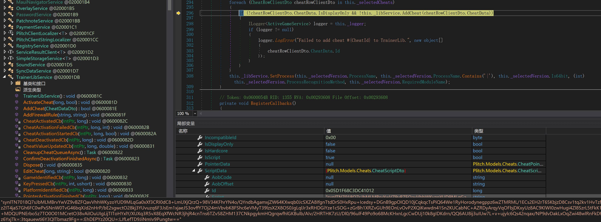

这个还是密文。


```cpp
		// Token: 0x0600081C RID: 2076 RVA: 0x002A7504 File Offset: 0x002A7504
		public TrainerLibService()
		{
			this._thisHandle = GCHandle.Alloc(this);
			this._libInterface = new TrainerLibService.LibInterface();
			this.SetupCallbacks();
			this._cheatEntries = new ConcurrentQueue<TrainerLibService.CheatActivationRecord>();
			Task.Run(() => this.StartCheatActivationQueue());
		}

		// Token: 0x0600081D RID: 2077 RVA: 0x002A7654 File Offset: 0x002A7654
		public void ActivateCheat(long cheatId, bool disableSound = false)
		{
			this._cheatEntries.Enqueue(new TrainerLibService.CheatActivationRecord(cheatId, disableSound));
		}

		// Token: 0x06000827 RID: 2087 RVA: 0x002A7A44 File Offset: 0x002A7A44
		[NullableContext(1)]
		private Task StartCheatActivationQueue()
		{
			TrainerLibService.<StartCheatActivationQueue>d__53 <StartCheatActivationQueue>d__;
			<StartCheatActivationQueue>d__.<>t__builder = AsyncTaskMethodBuilder.Create();
			<StartCheatActivationQueue>d__.<>4__this = this;
			<StartCheatActivationQueue>d__.<>1__state = -1;
			<StartCheatActivationQueue>d__.<>t__builder.Start<TrainerLibService.<StartCheatActivationQueue>d__53>(ref <StartCheatActivationQueue>d__);
			return <StartCheatActivationQueue>d__.<>t__builder.Task;
		}
```
消费者线程的代码在哪里？

dnspy是
```cpp
// Plitch.Client.Services.TrainerLibService
// Token: 0x06000827 RID: 2087 RVA: 0x002A7A44 File Offset: 0x002A7A44
[NullableContext(1)]
private Task StartCheatActivationQueue()
{
	TrainerLibService.<StartCheatActivationQueue>d__53 <StartCheatActivationQueue>d__;
	<StartCheatActivationQueue>d__.<>t__builder = AsyncTaskMethodBuilder.Create();
	<StartCheatActivationQueue>d__.<>4__this = this;
	<StartCheatActivationQueue>d__.<>1__state = -1;
	<StartCheatActivationQueue>d__.<>t__builder.Start<TrainerLibService.<StartCheatActivationQueue>d__53>(ref <StartCheatActivationQueue>d__);
	return <StartCheatActivationQueue>d__.<>t__builder.Task;
}
```
ilspy是
```cpp
// Plitch.Client.Services.TrainerLibService
using System.Threading.Tasks;
using Plitch.Client.Services.Authentication;
using Plitch.Models.Enums;
using Plitch.Models.User;

private async Task StartCheatActivationQueue()
{
	UserDto? currentUser = PlitchClientAuthenticationStateProvider.CurrentUser;
	bool showErrors = currentUser != null && currentUser.AccountType == AccountTypes.Team;
	while (true)
	{
		if (!_cheatEntries.IsEmpty)
		{
			if (_cheatActivation != null)
			{
				await Task.Delay(25);
				continue;
			}
			await _cheatActivationSemaphore.WaitAsync();
			try
			{
				CheatActivationRecord result;
				if (_cheatActivation != null)
				{
					await Task.Delay(25);
				}
				else if (_cheatEntries.TryDequeue(out result))
				{
					_cheatActivation = result;
					_libInterface.LibExecuteCheat(_cheatActivation.CheatId, showErrors);
				}
			}
			finally
			{
				_cheatActivationSemaphore.Release();
			}
		}
		else
		{
			await Task.Delay(500);
		}
	}
}

```

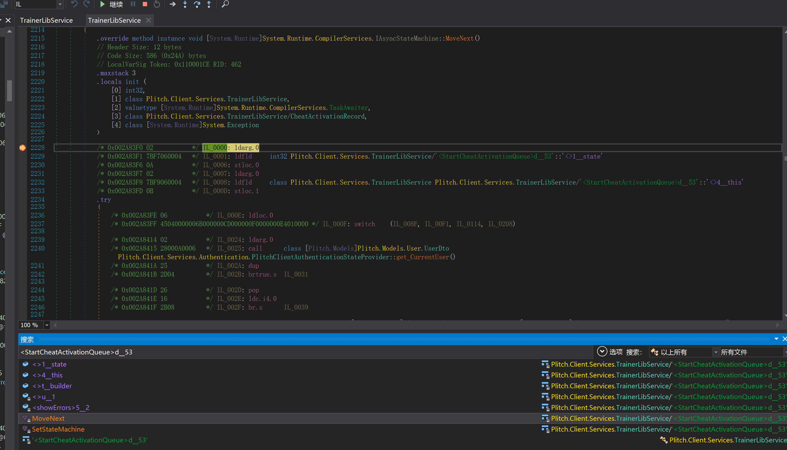

对MoveNext方法下断点，切换到IL视图，终于找到了ExecuteCheat的调用点。

但是如何查看参数数据内容呢？

```
        /* 0x002A85BF 20F4010000   */ IL_01CF: ldc.i4    500
        /* 0x002A85C4 28B102000A   */ IL_01D4: call      class [System.Runtime]System.Threading.Tasks.Task [System.Runtime]System.Threading.Tasks.Task::Delay(int32)
        /* 0x002A85C9 6FB202000A   */ IL_01D9: callvirt  instance valuetype [System.Runtime]System.Runtime.CompilerServices.TaskAwaiter [System.Runtime]System.Threading.Tasks.Task::GetAwaiter()
        /* 0x002A85CE 0C           */ IL_01DE: stloc.2
        /* 0x002A85CF 1202         */ IL_01DF: ldloca.s  V_2
        /* 0x002A85D1 28B302000A   */ IL_01E1: call      instance bool [System.Runtime]System.Runtime.CompilerServices.TaskAwaiter::get_IsCompleted()
        /* 0x002A85D6 2D3C         */ IL_01E6: brtrue.s  IL_0224
```

参数只是一个cheat id，根本没有字符串。

## 传给AddCheatEntry的参数
用x64dbg启动修改器，选择游戏，会触发AddCheatEntry。

```cpp
bool result = this._libInterface.LibAddCheatEntry(ref libCheatDefinition2);

// Token: 0x020001DF RID: 479
			public struct LibCheatDefinition
			{
				// Token: 0x040006E0 RID: 1760
				public long CheatId;

				// Token: 0x040006E1 RID: 1761
				public long DependencyId;

				// Token: 0x040006E2 RID: 1762
				public uint MemId;

				// Token: 0x040006E3 RID: 1763
				public uint CheatType;

				// Token: 0x040006E4 RID: 1764
				[Nullable(2)]
				[MarshalAs(UnmanagedType.LPWStr)]
				public string Script; // 这个宽字符串，传到dll，是密文

				// Token: 0x040006E5 RID: 1765
				public bool IsHidden;

				// Token: 0x040006E6 RID: 1766
				public IntPtr PointerDefinition;
			}
```
C#层传入的参数是一个结构体。

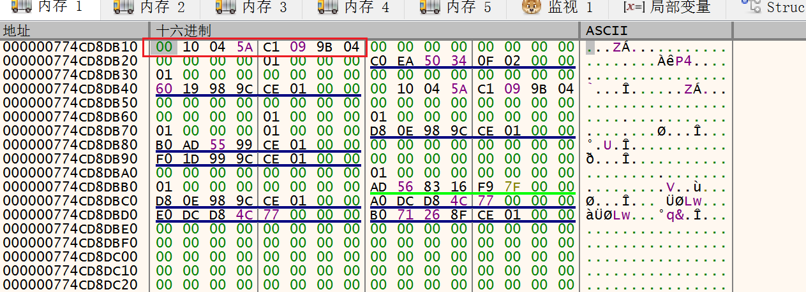

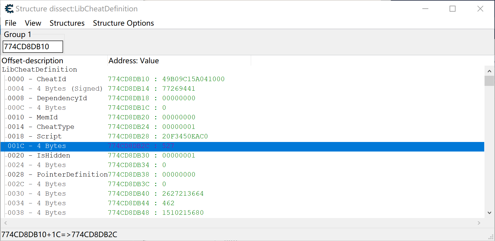

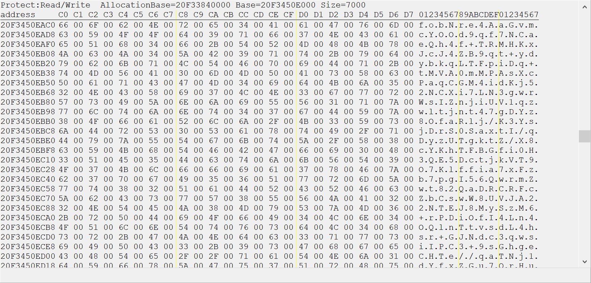

可见C#层根本就没有解密，传给TrainerLib的Script仍然是密文。

而这个密文是直接通过http从服务器下载来的，意味着加密代码没有在本地。

找到本地的解密代码，或许能还原为AA源码。但是本地没有加密函数，所以要想直接call dll，无法构造参数。

```cpp
  Concurrency::details::_TaskEventLogger::_LogScheduleTask((Concurrency::details::_TaskEventLogger *)(*a1 + 352LL), 0);
  v13 = *a1;
  v14 = sub_180105264(0x28u);
  *(_QWORD *)v14 = &___7___PPLTaskHandle__NU___InitialTaskHandle__NV_lambda_1___1__add_cheat_cheat_manager__QEAA_AV__task__N_Concurrency__QEAU_NEWCHEAT___Z_U_TypeSelectorNoAsync_details_5____task__N_Concurrency__U_TaskProcHandle_details_3__details_Concurrency__6B_;
  *(_QWORD *)(v14 + 8) = 0;
  *(_QWORD *)(v14 + 16) = 0;
  v15 = a1[1];
  if ( v15 )
    _InterlockedIncrement((volatile signed __int32 *)(v15 + 8));
  *(_QWORD *)(v14 + 8) = *a1;
  *(_QWORD *)(v14 + 16) = a1[1];
  *(_QWORD *)v14 = &___7___InitialTaskHandle__NV_lambda_1___1__add_cheat_cheat_manager__QEAA_AV__task__N_Concurrency__QEAU_NEWCHEAT___Z_U_TypeSelectorNoAsync_details_5____task__N_Concurrency__6B_;
  *(_OWORD *)(v14 + 24) = *a2_LibCheatDefinition;
  sub_18000D1D0(v13, v14, 0);
```
参数被拷贝到了一个闭包函数中，然后加入任务队列。

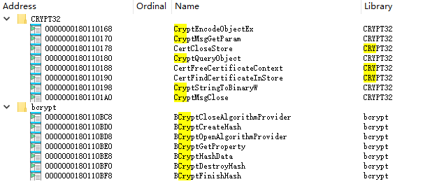
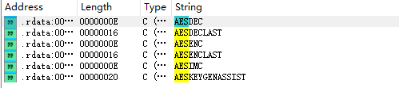

L"mKjqHDRUaTwFS3+Sv9LX4n151oYd8SdIw4PLf40raqXAM/fpDgfH9uLL+mf3QI3xxiP1VIRP1VLpuD2/s4LpZgF0UnTnJLTopUynGcgtmhXXZzBuxNriTlWg23o10w6AOtAwCusGx8tW24+zJ4MRScLxuQaSoohyWv1EQ2Rb4hshn2/ebCQv2G5TieLkm/64fJf5p1vZ/OdoGvL2aPkZ5bLs2OUf9Vgk9TdTBTI2vP5Bn2s/bUZkXpJTL+ynCrvFWnmAtp/pCCIyc3HtWgPlexpIETgAp5TbF8zDueqBNoeFnB9VnFs27kuaZon95zVc/qfG1tJpuQzOxn/8tUSkUIdE1lqj8viQxYKV6U2VDsp4uNJzjfhFe/WPRerwe6cSK51H6B9vsX6OZRRkMgRbVpQJhXQM+ZPDPV2rPvwk6yiJoIjQ/L3s1y4x2eDv7AY/tYTEOa2EbNQDRgP+vHBmQ0eqNryvxVpAKM0Riz1UUBD8YNzRURvAXMwGY6v"

这种加密字符串，每次重启后都不同，说明服务器会动态加密，没有用固定的key加密。

直接把这个加密字符串作为参数，应该也能成功运行。

## AES?
```
.text:00000001800429AB                 lea     r9, [rsp+384D8h+var_37AB4]
.text:00000001800429B3                 lea     r8, [rsp+384D8h+var_37AB0]
.text:00000001800429BB                 lea     rdx, [rsp+384D8h+var_37AAC]
.text:00000001800429C3                 lea     rcx, [rsp+384D8h+var_1DF08]
.text:00000001800429CB                 call    sub_1800B8BD0
.text:00000001800429D0                 mov     [rsp+384D8h+var_28870], rax
.text:00000001800429D8                 lea     rdx, aAeskeygenassis ; "AESKEYGENASSIST"
.text:00000001800429DF                 lea     rcx, [rsp+384D8h+var_23BD0]
.text:00000001800429E7                 call    sub_18000A600
```
AESKEYGENASSIST 不是 WinAPI

它是 AES-NI 指令的名字


| 指令                | opcode                |
| ----------------- | --------------------- |
| `AESENC`          | `66 0F 38 DC /r`      |
| `AESENCLAST`      | `66 0F 38 DD /r`      |
| **`AESDEC`**      | **`66 0F 38 DE /r`**  |
| `AESDECLAST`      | `66 0F 38 DF /r`      |
| `AESKEYGENASSIST` | `66 0F 3A DF /r imm8` |

搜索66 0F 38 DE, 发现bryptPrimitives.dll中有AESDEC指令。

但这个是底层dll。

## BCryptImportKey断点
```
00007FF94D0E3190 | 48:8BC4                  | mov rax,rsp                             |
00007FF94D0E3193 | 48:8958 08               | mov qword ptr ds:[rax+8],rbx            |
00007FF94D0E3197 | 48:8968 10               | mov qword ptr ds:[rax+10],rbp           |
00007FF94D0E319B | 48:8970 18               | mov qword ptr ds:[rax+18],rsi           | rsi:".\r"
00007FF94D0E319F | 4C:8948 20               | mov qword ptr ds:[rax+20],r9            |
00007FF94D0E31A3 | 57                       | push rdi                                |
00007FF94D0E31A4 | 41:54                    | push r12                                | r12:L"OpaqueKeyBlob"
00007FF94D0E31A6 | 41:55                    | push r13                                |
00007FF94D0E31A8 | 41:56                    | push r14                                |
00007FF94D0E31AA | 41:57                    | push r15                                | r15:GetSChannelInterface+14BD0
00007FF94D0E31AC | 48:81EC 80000000         | sub rsp,80                              |
00007FF94D0E31B3 | 4C:8BE1                  | mov r12,rcx                             | r12:L"OpaqueKeyBlob"
00007FF94D0E31B6 | 4D:8BE8                  | mov r13,r8                              | r8:L"OpaqueKeyBlob"
00007FF94D0E31B9 | 33C9                     | xor ecx,ecx                             |
```
r8是啥？

回溯其调用者是ssl模块，不是TrainerLib。

## 导入表
```
CRYPT32			
0000000180110168		CryptEncodeObjectEx	CRYPT32
0000000180110170		CryptMsgGetParam	CRYPT32
0000000180110178		CertCloseStore	CRYPT32
0000000180110180		CryptQueryObject	CRYPT32
0000000180110188		CertFreeCertificateContext	CRYPT32
0000000180110190		CertFindCertificateInStore	CRYPT32
0000000180110198		CryptStringToBinaryW	CRYPT32
00000001801101A0		CryptMsgClose	CRYPT32
bcrypt			
0000000180110BC8		BCryptCloseAlgorithmProvider	bcrypt
0000000180110BD0		BCryptCreateHash	bcrypt
0000000180110BD8		BCryptOpenAlgorithmProvider	bcrypt
0000000180110BE0		BCryptGetProperty	bcrypt
0000000180110BE8		BCryptHashData	bcrypt
0000000180110BF0		BCryptDestroyHash	bcrypt
0000000180110BF8		BCryptFinishHash	bcrypt
```

```
RAX : 00005E30F6A82973
RBX : 000001E3C5F548A0
RCX : 0000002B797BEC60
RDX : 00007FF90AB738D0     L"SHA256"
RBP : 0000002B797BEC69
RSP : 0000002B797BEBD8
RSI : 0000002B797BF1A0
RDI : 0000000000000000
R8  : 0000000000000000
R9  : 0000000000000008
R10 : 00007FF9410A0000     vcruntime140.00007FF9410A0000
R11 : 00007FF9410B2359     vcruntime140.00007FF9410B2359
R12 : 0000000000000000
R13 : 0000002B797BED18
R14 : 0000002B797BED48
R15 : 000001E3BB913BA0     &L"0mxPMtdqY2MuuDWBoCPq1Q=="
RIP : 00007FF94D0E5A60     <bcrypt.BCryptOpenAlgorithmProvider>
```

```
BOOL CryptStringToBinaryW(
  [in]      LPCWSTR pszString,
  [in]      DWORD   cchString,
  [in]      DWORD   dwFlags,
  [in]      BYTE    *pbBinary,
  [in, out] DWORD   *pcbBinary,
  [out]     DWORD   *pdwSkip,
  [out]     DWORD   *pdwFlags
);

RAX : 0000002B7EEFEAF8
RBX : 000001E3BE1EE040
RCX : 000001E3BB608310     L"LXkGkAZ2ijVdz1CjWetq65+ij7+VATqO3CtLsrcKyn/wIgZh1iwJmCaQtnc2pgu14wMPBukQZefvcnG1OC2Q9VElpSh0XzHf0CWVYh13wkFshKANG0mbJocxq4VRKlQAdA8jg8/aRj/wzG6TQAL+ZVJITPBatnHgvuxbrf/pfMJiQffW+4OCXZG+TJlMF5KFEoigQYb2oonnVe1A5l/Wy4cW8ToLyEaWn1AbG81CRyzdSl4Q3Eh9IqwqLNlE2rNelIzjTKfNL+/nb82Dif34GH+6wsFFB4BFnwlcog=="
RDX : 0000000000000128     L'Ĩ'
RBP : 00000000000000DC     'Ü'
RSP : 0000002B7EEFEA88
RSI : 000001E3BB608310     L"LXkGkAZ2ijVdz1CjWetq65+ij7+VATqO3CtLsrcKyn/wIgZh1iwJmCaQtnc2pgu14wMPBukQZefvcnG1OC2Q9VElpSh0XzHf0CWVYh13wkFshKANG0mbJocxq4VRKlQAdA8jg8/aRj/wzG6TQAL+ZVJITPBatnHgvuxbrf/pfMJiQffW+4OCXZG+TJlMF5KFEoigQYb2oonnVe1A5l/Wy4cW8ToLyEaWn1AbG81CRyzdSl4Q3Eh9IqwqLNlE2rNelIzjTKfNL+/nb82Dif34GH+6wsFFB4BFnwlcog=="
RDI : 0000002B7EEFEB90
R8  : 0000000000000001
R9  : 000001E3BE1EE040
R10 : 00007FF9410A0000     vcruntime140.00007FF9410A0000
R11 : 00007FF9410B291B     vcruntime140.00007FF9410B291B
R12 : 0000000000000000
R13 : 000001E3B0A5EE40
R14 : 0000000000000000
R15 : 000001E3BB608680     &L"0mxPMtdqY2MuuDWBoCPq1Q=="
RIP : 00007FF94D5FA6F0     <crypt32.CryptStringToBinaryW>


执行到返回，r9地址处的内存是：
000001E3BE1EE040  2D 79 06 90 06 76 8A 35 5D CF 50 A3 59 EB 6A EB  -y...v.5]ÏP£Yëjë  
000001E3BE1EE050  9F A2 8F BF 95 01 3A 8E DC 2B 4B B2 B7 0A CA 7F  .¢.¿..:.Ü+K²·.Ê.  
000001E3BE1EE060  F0 22 06 61 D6 2C 09 98 26 90 B6 77 36 A6 0B B5  ð".aÖ,..&.¶w6¦.µ  
000001E3BE1EE070  E3 03 0F 06 E9 10 65 E7 EF 72 71 B5 38 2D 90 F5  ã...é.eçïrqµ8-.õ  
000001E3BE1EE080  51 25 A5 28 74 5F 31 DF D0 25 95 62 1D 77 C2 41  Q%¥(t_1ßÐ%.b.wÂA  
000001E3BE1EE090  6C 84 A0 0D 1B 49 9B 26 87 31 AB 85 51 2A 54 00  l. ..I.&.1«.Q*T.  
000001E3BE1EE0A0  74 0F 23 83 CF DA 46 3F F0 CC 6E 93 40 02 FE 65  t.#.ÏÚF?ðÌn.@.þe  
000001E3BE1EE0B0  52 48 4C F0 5A B6 71 E0 BE EC 5B AD FF E9 7C C2  RHLðZ¶qà¾ì[.ÿé|  
000001E3BE1EE0C0  62 41 F7 D6 FB 83 82 5D 91 BE 4C 99 4C 17 92 85  bA÷Öû..].¾L.L...  
000001E3BE1EE0D0  12 88 A0 41 86 F6 A2 89 E7 55 ED 40 E6 5F D6 CB  .. A.ö¢.çUí@æ_ÖË  
000001E3BE1EE0E0  87 16 F1 3A 0B C8 46 96 9F 50 1B 1B CD 42 47 2C  ..ñ:.ÈF..P..ÍBG,  
000001E3BE1EE0F0  DD 4A 5E 10 DC 48 7D 22 AC 2A 2C D9 44 DA B3 5E  ÝJ^.ÜH}"¬*,ÙDÚ³^  
000001E3BE1EE100  94 8C E3 4C A7 CD 2F EF E7 6F CD 83 89 FD F8 18  ..ãL§Í/ïçoÍ..ýø.  
000001E3BE1EE110  7F BA C2 C1 45 07 80 45 9F 09 5C A2 AB AB AB AB  .ºÂÁE..E..\¢««««  
000001E3BE1EE120  AB AB AB AB AB AB AB AB AB AB AB AB EE FE EE FE  ««««««««««««îþîþ  

Base64字符串转为了二进制，但是仍然是密文。
对这个地址下硬件断点，后面被memmove触发，拷贝到了000001E3C3A1BD38，增加对000001E3C3A1BD38的硬件断点。

RAX : 00000000070D563F
RBX : 00000000B5F42A4C
RCX : 000000009006792D
RDX : 00000000A5540A74
RBP : 0000002B7EEFE850     "P轱~+"
RSP : 0000002B7EEFE750
RSI : 0000000066008A74
RDI : 000000003BE09348
R8  : 0000000052FF8A50
R9  : 00000000E6E7E2F6
R10 : 000001E3C3A1BD28
R11 : 00000000C3558FC1
R12 : 0000000072DBE686
R13 : 00000000CE8606FF
R14 : 00000000606B8459
R15 : 0000000027E80AD8
RIP : 00007FF94D2345C5     bcryptprimitives.00007FF94D2345C5

00007FF94D2345BA           | 44:8D89 F111F159         | lea r9d,qword ptr ds:[rcx+59F111F1]               |
00007FF94D2345C1           | 41:8B4A 10               | mov ecx,dword ptr ds:[r10+10]                     |
00007FF94D2345C5           | 41:33C0                  | xor eax,r8d                                       |

r10+10的地址就是硬件断点地址，bcryptprimitives触发了硬件断点。
```

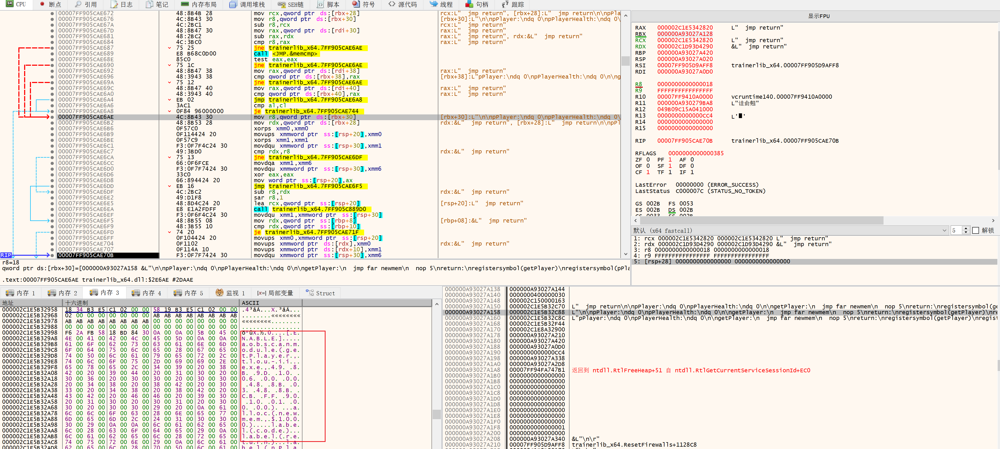

```
000002C1E5B32958  ......................................[ENABLE]..aobscanmodule(ge  
000002C1E5B329D8  tPlayer,tlou-ii.exe,49 8B 9D 10 06 00 00 48 8B 03 48 8B CB FF 90  
000002C1E5B32A58   10 01 00 00) .alloc(newmem,$1000)..label(code).label(return).la  
000002C1E5B32AD8  bel(pPlayer).label(pPlayerHealth)..newmem:..mov rbx,[r13+0000061  
000002C1E5B32B58  0]..mov [pPlayer],r13.mov [pPlayerHealth],rbx..code:.  mov rbx,[  
000002C1E5B32BD8  r13+00000610].  mov rax,[rbx].  mov rcx,rbx.  call qword ptr [ra  
000002C1E5B32C58  x+00000110].  jmp return..pPlayer:.dq 0.pPlayerHealth:.dq 0..get  
000002C1E5B32CD8  Player:.  jmp far newmem.  nop 5.return:.registersymbol(getPlaye  
000002C1E5B32D58  r).registersymbol(pPlayer).registersymbol(pPlayerHealth)..[DISAB  
000002C1E5B32DD8  LE]..getPlayer:.  db 49 8B 9D 10 06 00 00 48 8B 03 48 8B CB FF 9  
000002C1E5B32E58  0 10 01 00 00..unregistersymbol(getPlayer).unregistersymbol(pPla  
000002C1E5B32ED8  yer).unregistersymbol(pPlayerHealth).dealloc(newmem)............  
```

哈哈，看到明文了，还得是硬件断点，太强大了。

要直接把明文AA脚本作为输入调用dll，就要找到接受明文的私有函数去调用，或者研究出它怎么加密的，加密后再调用。都挺麻烦的。

也可以修改它的dll，让它不解密，直接用明文。这样应该最好。

## sig
```
x64dbg里是正常的：
00007FF905CAE600           | 48:895C24 20             | mov qword ptr ss:[rsp+20],rbx                     | 明文函数
00007FF905CAE605           | 55                       | push rbp                                          |
00007FF905CAE606           | 56                       | push rsi                                          | rsi:ResetFirewalls+1128C8
00007FF905CAE607           | 57                       | push rdi                                          |
00007FF905CAE608           | 48:83EC 70               | sub rsp,70                                        |
00007FF905CAE60C           | 0F297424 60              | movaps xmmword ptr ss:[rsp+60],xmm6               |

ce里却不一样：
TrainerLib_x64.dll+2E5FD - C3                    - ret 
TrainerLib_x64.dll+2E5FE - CC                    - int 3 
TrainerLib_x64.dll+2E5FF - CC                    - int 3 
TrainerLib_x64.dll+2E600 - CC                    - int 3 
TrainerLib_x64.dll+2E601 - 89 5C 24 20           - mov [rsp+20],ebx
TrainerLib_x64.dll+2E605 - CC                    - int 3 
TrainerLib_x64.dll+2E606 - 56                    - push rsi
TrainerLib_x64.dll+2E607 - 57                    - push rdi
TrainerLib_x64.dll+2E608 - 48 83 EC 70           - sub rsp,70 { 112 }
TrainerLib_x64.dll+2E60C - 0F29 74 24 60         - movaps [rsp+60],xmm6
TrainerLib_x64.dll+2E611 - 48 8B 05 28CA1000     - mov rax,[TrainerLib_x64.dll+13B040] { (15) }

ce多一个cc，导致后面全错了，而x64dbg里这个字节是48。
啥情况？

哦，x64dbg的软断点，污染了CE的内存读取。
```
找到一个可以直接看到明文的函数，做一个sig。

48 89 5C 24 ? 55 56 57 48 83 EC ? 0F 29 74 24

奇怪的是，我在IDA里，找到这个函数，但是其相对imagebase的偏移量和运行时不同，而且运行时出现了两个这个函数，机器码一样，它动态拷贝了一份出去执行？

后面发现这个函数只是碰巧出现了明文，密文也会出现，不是关键函数。失望了。

## 继续研究解密
```
00007FF905C89D00           | 48:8BCA                  | mov rcx,rdx                                       |
00007FF905C89D03           | 48:C1E9 0C               | shr rcx,C                                         |
00007FF905C89D07           | 48:33CA                  | xor rcx,rdx                                       |
00007FF905C89D0A           | 48:8BC1                  | mov rax,rcx                                       |
00007FF905C89D0D           | 48:C1E0 19               | shl rax,19                                        |
00007FF905C89D11           | 48:33C1                  | xor rax,rcx                                       |
00007FF905C89D14           | 48:8BD0                  | mov rdx,rax                                       |
00007FF905C89D17           | 48:C1EA 1B               | shr rdx,1B                                        |
00007FF905C89D1B           | 48:33D0                  | xor rdx,rax                                       |
00007FF905C89D1E           | 0FB6C2                   | movzx eax,dl                                      |
00007FF905C89D21           | 6BC8 1D                  | imul ecx,eax,1D                                   |
00007FF905C89D24           | 300F                     | xor byte ptr ds:[rdi],cl                          |
00007FF905C89D26           | 48:FFC7                  | inc rdi                                           |
00007FF905C89D29           | 49:3BF8                  | cmp rdi,r8                                        |
00007FF905C89D2C           | 75 D2                    | jne trainerlib_x64.7FF905C89D00                   |

这个循环作用在base64转为的二进制数组上，这个循环在干嘛？
应该是初步解密，后面还有。
```

```
00007FF905C89DA3           | 48:8D4C24 30             | lea rcx,qword ptr ss:[rsp+30]                       | [rsp+30]:L"\n\n[ENABLE]\n\naobscanmodule(getPlayer,tlou-ii.exe,49 8B 9D 10 06 00 00 48 8B 03 48 8B CB FF 90 10 01 00 00) \nalloc(newmem,$1000)\n\nlabel(code)\nlabel(return)\nlabel(pPlayer)\nlabel(pPlayerHealth)\n\nnewmem:\n\nmov rbx,[r13+00000610]\n\nmov [pPlayer],r13\nmov [pPlayerHealth],rbx\n\ncode:\n  mov rbx,[r13+00000610]\n  mov rax,[rbx]\n  mov rcx,rbx\n  call qword ptr [rax+00000110]\n  jmp return\n\npPlayer:\ndq 0\npPlayerHealth:\ndq 0\n\ngetPlayer:\n  jmp far newmem\n  nop 5\nreturn:\nregistersym
00007FF905C89DA8           | E8 F3030000              | call trainerlib_x64.7FF905C8A1A0                    |
00007FF905C89DAD           | 48:8B4C24 30             | mov rcx,qword ptr ss:[rsp+30]                       | rcx是buffer
00007FF905C89DB2           | 48:8B5424 38             | mov rdx,qword ptr ss:[rsp+38]                       | rdx是size？
00007FF905C89DB7           | 48:2BD1                  | sub rdx,rcx                                         | 减法，果然应该是size
00007FF905C89DBA           | 4C:8BCF                  | mov r9,rdi                                          |
00007FF905C89DBD           | 4C:8D43 04               | lea r8,qword ptr ds:[rbx+4]                         | rbx+04:"鈈郻坒pe餭pdpb餫pe坋"
00007FF905C89DC1           | E8 BA1E0000              | call trainerlib_x64.7FF905C8BC80                    | 这个call之后，明文瞬间就出来了，CE搜索[ENABLE]就可以找到AA源码了，所以这里是关键
00007FF905C89DC6           | 48:83F8 FF               | cmp rax,FFFFFFFFFFFFFFFF                            | call之后，rsp+30处就出现了AA脚本明文字符串
00007FF905C89DCA           | 0F84 B8020000            | je trainerlib_x64.7FF905C8A088                      |
```

E8 ? ? ? ? 48 83 F8 FF 0F 84 ? ? ? ?

用这个特征码在IDA中找到
```
.text:000000018000A181 48 8B 4C 24 78                                mov     rcx, qword ptr [rsp+1E0h+var_168]
.text:000000018000A186 4C 8D 4B FC                                   lea     r9, [rbx-4]
.text:000000018000A18A 48 8B 55 80                                   mov     rdx, qword ptr [rbp+0E0h+var_168+8]
.text:000000018000A18E 48 2B D1                                      sub     rdx, rcx
.text:000000018000A191 4C 8B C7                                      mov     r8, rdi
.text:000000018000A194 E8 B7 1B 00 00                                call    fn_do_decrypt_18000BD50
.text:000000018000A199 48 83 F8 FF                                   cmp     rax, 0FFFFFFFFFFFFFFFFh
.text:000000018000A19D 0F 84 FC 00 00 00                             jz      loc_18000A29F
```
对比发现，传参数的指令不一样。而且IDA中只有这一个地方call了解密函数。难道运行时的代码是动态生成的？

但是在IDA中可以找到解密函数本身。
```
.text:000000018000BD50                               ; __int64 __fastcall fn_do_decrypt_18000BD50(__int64, __int64, __int64, __int64)
.text:000000018000BD50                               fn_do_decrypt_18000BD50 proc near       ; CODE XREF: sub_180009CC0+4D4↑p
.text:000000018000BD50                                                                       ; DATA XREF: .pdata:000000018014B534↓o
.text:000000018000BD50
.text:000000018000BD50                               var_2108        = qword ptr -2108h
.text:000000018000BD50                               var_2100        = qword ptr -2100h
.text:000000018000BD50                               var_20F8        = dword ptr -20F8h
.text:000000018000BD50                               var_20E8        = qword ptr -20E8h
.text:000000018000BD50                               var_20E0        = qword ptr -20E0h
.text:000000018000BD50                               var_20D8        = dword ptr -20D8h
.text:000000018000BD50                               var_18          = qword ptr -18h
.text:000000018000BD50
.text:000000018000BD50                               ; __unwind { // __GSHandlerCheck
.text:000000018000BD50 B8 28 21 00 00                                mov     eax, 2128h
.text:000000018000BD55 E8 C6 A6 0F 00                                call    __alloca_probe
.text:000000018000BD5A 48 2B E0                                      sub     rsp, rax
.text:000000018000BD5D 48 8B 05 DC 02 13 00                          mov     rax, cs:__security_cookie
.text:000000018000BD64 48 33 C4                                      xor     rax, rsp
.text:000000018000BD67 48 89 84 24 10 21 00 00                       mov     [rsp+2128h+var_18], rax
.text:000000018000BD6F 48 89 54 24 40                                mov     [rsp+2128h+var_20E8], rdx
.text:000000018000BD74 49 8B C0                                      mov     rax, r8
.text:000000018000BD77 48 8D 54 24 40                                lea     rdx, [rsp+2128h+var_20E8]
.text:000000018000BD7C C7 44 24 30 04 00 00 00                       mov     [rsp+2128h+var_20F8], 4
.text:000000018000BD84 48 89 54 24 28                                mov     [rsp+2128h+var_2100], rdx
.text:000000018000BD89 4C 8D 44 24 48                                lea     r8, [rsp+2128h+var_20E0]
.text:000000018000BD8E 4C 89 4C 24 48                                mov     [rsp+2128h+var_20E0], r9
.text:000000018000BD93 48 8B D0                                      mov     rdx, rax
.text:000000018000BD96 48 89 4C 24 20                                mov     [rsp+2128h+var_2108], rcx
.text:000000018000BD9B 4C 8B C9                                      mov     r9, rcx
.text:000000018000BD9E 48 8D 4C 24 50                                lea     rcx, [rsp+2128h+var_20D8]
.text:000000018000BDA3 C7 44 24 50 00 00 00 00                       mov     [rsp+2128h+var_20D8], 0
.text:000000018000BDAB E8 70 E9 FF FF                                call    sub_18000A720   ; 这是一个非常复杂的函数
.text:000000018000BDB0 48 8B 4C 24 40                                mov     rcx, [rsp+2128h+var_20E8]
.text:000000018000BDB5 85 C0                                         test    eax, eax
.text:000000018000BDB7 48 C7 C2 FF FF FF FF                          mov     rdx, 0FFFFFFFFFFFFFFFFh
.text:000000018000BDBE 48 0F 45 CA                                   cmovnz  rcx, rdx
.text:000000018000BDC2 48 8B C1                                      mov     rax, rcx
.text:000000018000BDC5 48 8B 8C 24 10 21 00 00                       mov     rcx, [rsp+2128h+var_18]
.text:000000018000BDCD 48 33 CC                                      xor     rcx, rsp        ; StackCookie
.text:000000018000BDD0 E8 3B 94 0F 00                                call    __security_check_cookie
.text:000000018000BDD5 48 81 C4 28 21 00 00                          add     rsp, 2128h
.text:000000018000BDDC C3                                            retn
.text:000000018000BDDC                               ; } // starts at 18000BD50
.text:000000018000BDDC                               fn_do_decrypt_18000BD50 endp
```
只能在这个解密函数头部生成sig，因为它的调用者代码是动态生成的。

B8 ? ? ? ? E8 ? ? ? ? 48 2B E0 48 8B 05 ? ? ? ? 48 33 C4 48 89 84 24 ? ? ? ? 48 89 54 24

对明文地址下硬件断点，可能找到它是在哪里把明文清理掉的，明文存在短暂时间后就消失了，CE就搜索不到了。

最简单的patch方案，可能是让解密函数直接返回，不解密？如果入参直接就是明文的话。

## 开始写代码
### patch 解密函数
```cpp
#include <detours/detours.h>

#include "../disassemble/disassemble.h"
#include "../util/util.h"

uint64_t g_module_TrainerLib = 0;
uint64_t g_fn_decrypt = 0;

static void my_decrypt(void *buffer, uint64_t size, void *r8, void *r9) {
    LOG("> my_decrypt: buffer: %p, size: %llu", buffer, size);
    ((decltype(my_decrypt) *)g_fn_decrypt)(buffer, size, r8, r9);
    // 拷贝明文
    std::vector<uint8_t> script(size);
    std::memcpy(script.data(), buffer, size);
    LOG("script: %ws", (wchar_t *)script.data());
    LOG("< my_decrypt");
}

void patch_dll() {
    g_module_TrainerLib = (uint64_t)GetModuleHandleW(L"TrainerLib_x64.dll");
    LOG("g_module_TrainerLib: %llx", g_module_TrainerLib);
    g_fn_decrypt =
        util::search_signature("B8 ? ? ? ? E8 ? ? ? ? 48 2B E0 48 8B 05 ? ? ? ? 48 33 C4 48 89 84 24 ? ? ? ? 48 89 54 24",
                               g_module_TrainerLib, 0x10000);
    LOG("fn_decrypt: %llx", g_fn_decrypt);

    uint64_t before_ret = 0;
    ulib::Disassembler dis;
    dis.print(g_fn_decrypt, (void *)g_fn_decrypt, 0x200,
              [&before_ret](uint64_t addr, ZydisDecodedInstruction &instr, ZydisDecodedOperand *ops) {
                  if (instr.mnemonic == ZYDIS_MNEMONIC_RET) {
                      LOG("ret: %llx", addr);
                      before_ret = addr - 1;
                      return true;
                  }
                  return false;
              });
    DetourTransactionBegin();
    DetourUpdateThread(GetCurrentThread());
    DetourAttach(&(PVOID &)g_fn_decrypt, (void *)my_decrypt);
    DetourTransactionCommit();
}
```

用ExtremeInjector将patch.dll注入到修改器进程，然后进入最后生还者2，点击修改器的准备按钮，即可得到所有AA脚本源码。

破案了！！！

```
[LOG] > my_decrypt: buffer: 0000026D9A270AE0, size: 1444
[LOG] script:

[ENABLE]

aobscanmodule(getPlayer,tlou-ii.exe,49 8B 9D 10 06 00 00 48 8B 03 48 8B CB FF 90 10 01 00 00)
alloc(newmem,$1000)

label(code)
label(return)
label(pPlayer)
label(pPlayerHealth)

newmem:

mov rbx,[r13+00000610]

mov [pPlayer],r13
mov [pPlayerHealth],rbx

code:
  mov rbx,[r13+00000610]
  mov rax,[rbx]
  mov rcx,rbx
  call qword ptr [rax+00000110]
  jmp return

pPlayer:
dq 0
pPlayerHealth:
dq 0

getPlayer:
  jmp far newmem
  nop 5
return:
registersymbol(getPlayer)
registersymbol(pPlayer)
registersymbol(pPlayerHealth)

[DISABLE]

getPlayer:
  db 49 8B 9D 10 06 00 00 48 8B 03 48 8B CB FF 90 10 01 00 00

unregistersymbol(getPlayer)
unregistersymbol(pPlayer)
unregistersymbol(pPlayerHealth)
dealloc(newmem)

[LOG] < my_decrypt
[LOG] > my_decrypt: buffer: 0000026D878C91E0, size: 1528
[LOG] script:

[ENABLE]

aobscanmodule(prepareDamage,$process,C5 F2 59 83 54 01 00 00 C5 EA 5C D0 89 43 48)
alloc(newmem,$1000)

label(code)
label(return)
label(fDmgMulti)
label(fAiDmgMulti)

newmem:
push r15
mov rcx,pPlayerHealth
cmp [rcx],rbx
jne _ai
mulss xmm1,[fDmgMulti]
jmp code

_ai:
mulss xmm1,[fAiDmgMulti]

code:
pop r15

  db C5 F2 59 83 54 01 00 00

  db C5 EA 5C D0
  mov [rbx+48],eax
  jmp return

fDmgMulti:
dd (float)1
fAiDmgMulti:
dd (float)1

prepareDamage:
  jmp far newmem
  nop
return:
registersymbol(prepareDamage)
registersymbol(fDmgMulti)
registersymbol(fAiDmgMulti)

[DISABLE]

prepareDamage:
  db C5 F2 59 83 54 01 00 00 C5 EA 5C D0 89 43 48

unregistersymbol(prepareDamage)
unregistersymbol(fDmgMulti)
unregistersymbol(fAiDmgMulti)
dealloc(newmem)
```

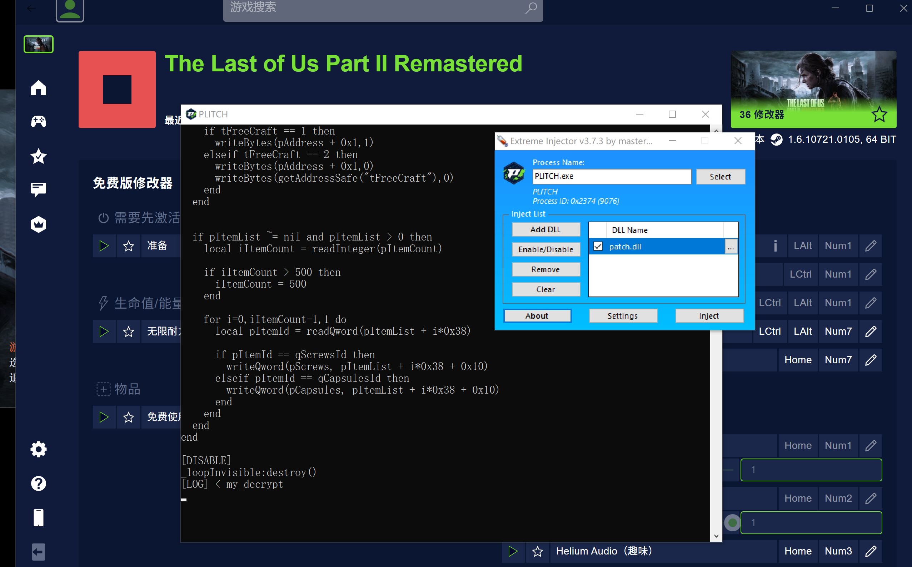

需要点一下准备，得到了一大堆源码，除了AA还有lua。但只是准备阶段的代码，其它功能，需要点其它按钮触发。

接下来再看看怎么调用。直接call它的dllmain会初始化失败，可能有检测吧。

### 导出json
```cpp
static uint64_t m_fn_AddCheatEntry = 0;
static BOOL my_AddCheatEntry(trainer_lib::LibCheatDefinition *newCheat) {
    LOG("> my_AddCheatEntry: %p", newCheat);
    trainer_lib::JSONLibCheatDefinition o;
    o.from_LibCheatDefinition(*newCheat);
    auto s = nlohmann::json(o).dump();
    // Script字符串是加密的
    // LOG("dump: %s", s.c_str());
    m_id2cheat[o.CheatId] = o;
    auto ret = ((decltype(my_AddCheatEntry) *)m_fn_AddCheatEntry)(newCheat);
    return ret;
}

static void hook_fn_AddCheatEntry() {
    m_fn_AddCheatEntry = (uint64_t)GetProcAddress((HMODULE)m_module_TrainerLib, "AddCheatEntry");
    util::do_hook(&(PVOID &)m_fn_AddCheatEntry, (void *)my_AddCheatEntry);
    LOG("< hook_fn_AddCheatEntry");
}

static uint64_t m_fn_ExecuteCheat = 0;
static void my_ExecuteCheat(int64_t cheatId, BOOL showErrors) {
    LOG("> my_ExecuteCheat: %llx", cheatId);
    auto &cheat = m_id2cheat[cheatId];
    auto s = nlohmann::json(cheat).dump();
    LOG("%s", s.c_str());
    ((decltype(my_ExecuteCheat) *)m_fn_ExecuteCheat)(cheatId, showErrors);

    // 写到文件中
    std::vector<trainer_lib::JSONLibCheatDefinition> arr;
    for (auto &it : m_id2cheat) {
        arr.push_back(it.second);
    }
    std::ofstream fos("cheat.json", std::ios::out | std::ios::trunc);
    fos << nlohmann::json(arr).dump(4);
    fos.close();
}

static void hook_fn_ExecuteCheat() {
    m_fn_ExecuteCheat = (uint64_t)GetProcAddress((HMODULE)m_module_TrainerLib, "ExecuteCheat");
    util::do_hook(&(PVOID &)m_fn_ExecuteCheat, (void *)my_ExecuteCheat);
    LOG("< hook_fn_ExecuteCheat");
}

void patch_dll() {
    m_module_TrainerLib = (uint64_t)GetModuleHandleW(L"TrainerLib_x64.dll");
    LOG("g_module_TrainerLib: %llx", m_module_TrainerLib);
    hook_fn_AddCheatEntry();
    hook_fn_ExecuteCheat();
    hook_fn_decrypt();
}
```
得到
```
[
    {
        "CheatId": 331871702697119745,
        "CheatType": 1,
        "DependencyId": 331869723589611523,
        "IsHidden": 0,
        "MemId": 1,
        "PointerDefinition": 0,
        "Script": "Fl7lUmL5fvIahOnolFmNkIkEs036S5T1v5+NN4rosX90/JgkxJVpttW+zuDyVcFxmuTXzd4z3Knz/YHFHpu1i6lF0xqShSsv26dRfkA=:bQHe7vgG2NabEBiiIY7STw==:HxDEPYz20QU=:Qno/pE4rOqJ6JHMPkD92FQ=="
    },
    {
        "CheatId": 331869723585417216,
        "CheatType": 1,
        "DependencyId": 0,
        "IsHidden": 1,
        "MemId": 0,
        "PointerDefinition": 0,
        "Script": "vt2soRlr1NUXhbxwfB0oxvbRqmF9PLA0DquvkX5OXvsFEYDs8dgahfjSHXXsatI7hd7Cez7M/lMtatkVnsPkTuZM/OI4ZCu6hM9gH+dyT8OUINbN3YAX36Yp4t7FRsTMo9e8R/TfCSPRbc3RG8NEoxwqtoqI4N79ehcq8ncyEMS/+/iNc1GYpip2Il40tGPZzxEHkqCBRMp0aQkZLlyZ3BkAPHV3Q45kUSlZHa1zjjWRT6kq5l1/P5KxVehHBHkg/n8uTDyzPaJhYFc3lQRQo+4VXX4Q3aM7LGFbFoW9dpZTwgjrz3JRYYlibNZ2Nh4LDjP3DVfnmxPwN9I2S8N/dbWTm1b8mzMrgzgjB4qJmSF4wJj6osfThUyh3livbyyOt5Nhq619BHSN4t27lpD6lfwq268qUStUGd0XbtUJFfFJoc7YMo4XZNvO2uVP1AHV2NOmK6hmuYT97hM7CzBcYASnO+5T927FUGcEh1V9I3eFzRZPFm7Jygk10GIQHJiiNK6rV6swCxKCEAyMmKGYuO7pvNby0SP7ehQqecHzHOCN2QLeCab/1japH7Q8mg7o9Bdcx5yNl83vDA1LV8lbf33AwR7NM38HWznlB7rw3vMZFPyCmZM+DxAKupswD5QWtEiztL0NivRdGfeJfakQpkzhw4koePQ/L6foBShrMMj1uhaC85a34kb9KJIOtqzQx0kF9zbF1PQ7XAn65RIihrVrpxF2f3Q=:+aQnOUf5ua98Hwbzo4bDng==:EhDEPYz20QU=:lbti6wGk0EM6nQYBfhJyeg=="
    },
    {
        "CheatId": 331869723589611520,
        "CheatType": 1,
        "DependencyId": 331869723585417216,
        "IsHidden": 1,
        "MemId": 0,
        "PointerDefinition": 0,
        "Script": "UZ3+rUfHIzuj5KkWwEm5OAIpBYAlSAj+dsB0LYanvteLWbGUBxAgAVUKuvNnAvV75Lim1qc67GgNdYqw7+KDpP5gcqC8Qc6mtyoI6Etucal3SLqjQTrqKZttCJ7itDfedVzTAjjom9jkRqzOUOsoG+Hf7/UfH7pOL0Ejqc5oUO59wt1D2rA8q1VX4X40Und2k1m4sYWkijlf2Eyh/8UEYFBVPoXKuOo5lBvtEHA+P04+BHcCOqGuFXHubceJmwQryWSjUKkn5s0FokBBaKDddlRPV3C62NpMSlV7TtTGB1gtBNQx1SHwFht8mLGJQMYREamkTBXhzEnnfOglTefqPXdHDRFmL/+YtvdGbHYE14tnDvPQznl4GqJOyFGrL1AZJCoSH8E+7STcvGVIyyMTWTBH+yn4B13S27goPve/V3EPdJydNWvBqDTh+do7+BC+Uav26ddPfRZrIxq9mnXWDi/bS0Yv/HJQVS1ZKvGQ3Ge8SD6rEHMfghI2+Ip4FND++ql55GSWznGwSGE8cngmb9yZZBYcsyPtp1I6bRNK2yR1ma+qHHyViJRsK1pBkwdY8WA+zdpbUnlcHp3JMADH0BG+5EDkwtzSg4el/OGIs6XWAdkj4wBPmAHTZOnFojf+Klh4qWxat4aEH6CP0SsAnTKM44H9znV1J0y2Wc9jTxhdMMaR6CDJYR+3NCy4+v0mvNJBIFB9jt3ZpOxsoWgjCWIFgHGwshNrzm4Ydac+lI2DnXvxQkPQh+dX6Ug2I79Kct5kQHRGfO4rFEUjXCbYB1PExBQpobXzOwzwXcNDkKNard9lPag6cPDTzoawhuORNcCDYsbD:cI8so2iYKPhXeTJ6krFgFQ==:ExDEPYz20QU=:3gCG7HDIzpbXcKdLoW2jUQ=="
    },
    {
        "CheatId": 332126147490091020,
        "CheatType": 7,
        "DependencyId": 331869723589611523,
        "IsHidden": 0,
        "MemId": 4,
        "PointerDefinition": 3023059777168,
        "Script": ""
    },
    ...
]
```
可以看出，有的是脚本，有的是PointerDefinition，主要是这两类。

### 调用测试
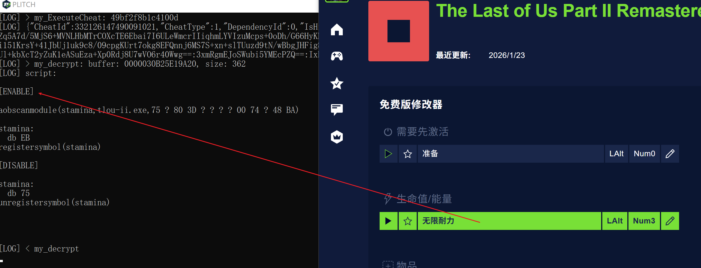
点击无限耐力，会触发ExecuteCheat，它会取出那个Entry，然后调用解密函数解密Script字符串，然后执行脚本，让功能生效。

这个脚本没有依赖，也不是PointerDefinition类型，刚好可以拿来进行调用测试。

### DllMain 初始化失败问题
```
00007FFE51639738       | 48:894424 40             | mov qword ptr ss:[rsp+40],rax                       |
00007FFE5163973D       | 41:B8 00040000           | mov r8d,400                                         |
00007FFE51639743       | 48:895C24 38             | mov qword ptr ss:[rsp+38],rbx                       |
00007FFE51639748       | 48:8D45 94               | lea rax,qword ptr ss:[rbp-6C]                       |
00007FFE5163974C       | 48:895C24 30             | mov qword ptr ss:[rsp+30],rbx                       |
00007FFE51639751       | B9 01000000              | mov ecx,1                                           |
00007FFE51639756       | 48:894424 28             | mov qword ptr ss:[rsp+28],rax                       |
00007FFE5163975B       | 895C24 20                | mov dword ptr ss:[rsp+20],ebx                       |
00007FFE5163975F       | FF15 1B6A1000            | call qword ptr ds:[<CryptQueryObject>]              | 重点在这里，会失败
00007FFE51639765       | 85C0                     | test eax,eax                                        |
00007FFE51639767       | 74 3B                    | je trainerlib_x64.7FFE516397A4                      |
00007FFE51639769       | 48:8B4D 80               | mov rcx,qword ptr ss:[rbp-80]                       |
00007FFE5163976D       | 48:8D45 90               | lea rax,qword ptr ss:[rbp-70]                       |
00007FFE51639771       | 45:33C9                  | xor r9d,r9d                                         |
00007FFE51639774       | 48:894424 20             | mov qword ptr ss:[rsp+20],rax                       |
00007FFE51639779       | 45:33C0                  | xor r8d,r8d                                         |
00007FFE5163977C       | 895D 90                  | mov dword ptr ss:[rbp-70],ebx                       |
00007FFE5163977F       | BA 06000000              | mov edx,6                                           |
00007FFE51639784       | FF15 E6691000            | call qword ptr ds:[<CryptMsgGetParam>]              |
00007FFE5163978A       | 85C0                     | test eax,eax                                        |
00007FFE5163978C       | 75 1D                    | jne trainerlib_x64.7FFE516397AB                     |
00007FFE5163978E       | 48:8B4D 88               | mov rcx,qword ptr ss:[rbp-78]                       |
00007FFE51639792       | 33D2                     | xor edx,edx                                         |
00007FFE51639794       | FF15 DE691000            | call qword ptr ds:[<CertCloseStore>]                |
00007FFE5163979A       | 48:8B4D 80               | mov rcx,qword ptr ss:[rbp-80]                       |
00007FFE5163979E       | FF15 FC691000            | call qword ptr ds:[<CryptMsgClose>]                 |
00007FFE516397A4       | 32C0                     | xor al,al                                           |
00007FFE516397A6       | E9 9D010000              | jmp trainerlib_x64.7FFE51639948                     |
00007FFE516397AB       | 8B4D 90                  | mov ecx,dword ptr ss:[rbp-70]                       |
00007FFE516397AE       | 48:89BC24 C0010000       | mov qword ptr ss:[rsp+1C0],rdi                      |
00007FFE516397B6       | FF15 84721000            | call qword ptr ds:[<malloc>]                        |
00007FFE516397BC       | 48:8BF8                  | mov rdi,rax                                         |
00007FFE516397BF       | 48:85C0                  | test rax,rax                                        |
00007FFE516397C2       | 74 2B                    | je trainerlib_x64.7FFE516397EF                      |
00007FFE516397C4       | 48:8B4D 80               | mov rcx,qword ptr ss:[rbp-80]                       |
00007FFE516397C8       | 48:8D45 90               | lea rax,qword ptr ss:[rbp-70]                       |
00007FFE516397CC       | 4C:8BCF                  | mov r9,rdi                                          |
00007FFE516397CF       | 48:894424 20             | mov qword ptr ss:[rsp+20],rax                       |
00007FFE516397D4       | 45:33C0                  | xor r8d,r8d                                         |
00007FFE516397D7       | BA 06000000              | mov edx,6                                           |
00007FFE516397DC       | FF15 8E691000            | call qword ptr ds:[<CryptMsgGetParam>]              |
00007FFE516397E2       | 85C0                     | test eax,eax                                        |
00007FFE516397E4       | 75 26                    | jne trainerlib_x64.7FFE5163980C                     |
```
和正常情况单步调试进行对比，发现主要区别在这里，CryptQueryObject会返回0，DllMain后续也就返回0了。

它在检查调用它的exe模块是否合法。

```
00000216CE209904       | E8 3BDA0F00              | call <JMP.&memcmp>                         |
00000216CE209909       | 48:8BCE                  | mov rcx,rsi                                |
00000216CE20990C       | 8BD8                     | mov ebx,eax                                |
00000216CE20990E       | FF15 74681000            | call qword ptr ds:[<&CertFreeCertificateCo |
00000216CE209914       | 48:8BCF                  | mov rcx,rdi                                |
00000216CE209917       | FF15 2B711000            | call qword ptr ds:[<&free>]                |
00000216CE20991D       | 48:8B4D 88               | mov rcx,qword ptr ss:[rbp-78]              |
00000216CE209921       | 33D2                     | xor edx,edx                                |
00000216CE209923       | FF15 4F681000            | call qword ptr ds:[<&CertCloseStore>]      |
00000216CE209929       | 48:8B4D 80               | mov rcx,qword ptr ss:[rbp-80]              |
00000216CE20992D       | FF15 6D681000            | call qword ptr ds:[<&CryptMsgClose>]       |
00000216CE209933       | 85DB                     | test ebx,ebx                               |
00000216CE209935       | 0F94C0                   | sete al                                    |
00000216CE209938       | 48:8BB424 B8010000       | mov rsi,qword ptr ss:[rsp+1B8]             |
00000216CE209940       | 48:8BBC24 C0010000       | mov rdi,qword ptr ss:[rsp+1C0]             |
00000216CE209948       | 48:8B8D 90000000         | mov rcx,qword ptr ss:[rbp+90]              |
00000216CE20994F       | 48:33CC                  | xor rcx,rsp                                |
00000216CE209952       | E8 A9CB0F00              | call 216CE306500                           |
00000216CE209957       | 48:8B9C24 C8010000       | mov rbx,qword ptr ss:[rsp+1C8]             |
00000216CE20995F       | 48:81C4 A0010000         | add rsp,1A0                                |
00000216CE209966       | 5D                       | pop rbp                                    |
00000216CE209967       | C3                       | ret                                        |
```
这里做了很多Cert相关函数的调用。

在x64dbg里，ret之前，手动把rax置为1，后续调用函数，直接就能返回成功了。

```
[LOG] > setup_callbacks
[LOG] cheat: 332126147490091021, RSIZq5A7d/5MjS6+MVNLHbMTrCOXcTE6Ebai7I6ULeWmcrIIiqhmLYVIzuMcps+0oDh/G66HyKNS3NDYtsMnc+npHS4gnqGqf7DpG2GhxcOZfD3oU9g3aOQixCkzxd/Vi151KrsY+41JbUj1uk9c8/09cpgKUrt7okg8EFQnnj6MS7S+xn+slTUuzd9tN/wBbgJHFig8L6lpecWFSTLWulHdcwUJKcyNtXsDrXr6wmYP+bf5nv5iuUVm/gK+SUl+kbXcT2yZuK1eASuEza+Xp0Rdj8U7wVO6r40Wwg==:3xmRgmEJoSWubi5YMEcPZQ==:IxDEPYz20QU=:2MkdwzPP3EC0MgwWVoUlPA==
[LOG] AddCheatEntry ret: 1
[LOG] GetLastLibError ret: 0
[LOG] < entry
[LOG] cbCheatActivationFailed: 49bf2f8b1c4100d, errorCode: 7
[LOG] cbKeyPressed: 1, 49
[LOG] cbKeyPressed: 1, c0
[LOG] cbKeyPressed: 1, c0
[LOG] cbKeyPressed: 1, c0
[LOG] cbKeyPressed: 1, 4a
[LOG] cbKeyPressed: 1, 4b
[LOG] cbKeyPressed: 1, 4f
```
从日志来看，键盘事件回调函数也生效了，说明如此简单的操作即可绕过它这个检查。

```cpp
bool __fastcall fn_check_cert_180009A30(_QWORD *pvObject)
{
  bool v1; // cc
  char *v3; // rdi
  __int128 v4; // xmm1
  PCCERT_CONTEXT CertificateInStore; // rax
  const CERT_CONTEXT *v6; // rsi
  int v7; // ebx
  _DWORD Buf2[8]; // [rsp+60h] [rbp-A0h] BYREF
  HCRYPTMSG hCryptMsg; // [rsp+80h] [rbp-80h] BYREF
  HCERTSTORE hCertStore; // [rsp+88h] [rbp-78h] BYREF
  DWORD pcbData; // [rsp+90h] [rbp-70h] BYREF
  DWORD pdwMsgAndCertEncodingType[3]; // [rsp+94h] [rbp-6Ch] BYREF
  _OWORD pvFindPara[13]; // [rsp+A0h] [rbp-60h] BYREF
  _OWORD Buf1[2]; // [rsp+170h] [rbp+70h] BYREF

  v1 = pvObject[3] <= 7u;
  hCryptMsg = 0;
  hCertStore = 0;
  pdwMsgAndCertEncodingType[0] = 0;
  if ( !v1 )
    pvObject = (_QWORD *)*pvObject;
  if ( !CryptQueryObject(1u, pvObject, 0x400u, 2u, 0, pdwMsgAndCertEncodingType, 0, 0, &hCertStore, &hCryptMsg, 0) )
    return 0;
  pcbData = 0;
  if ( !CryptMsgGetParam(hCryptMsg, 6u, 0, 0, &pcbData) )
  {
    CertCloseStore(hCertStore, 0);
    CryptMsgClose(hCryptMsg);
    return 0;
  }
  v3 = (char *)malloc(pcbData);
  if ( !v3 )
    goto LABEL_10;
  if ( !CryptMsgGetParam(hCryptMsg, 6u, 0, v3, &pcbData) )
  {
    free(v3);
LABEL_10:
    CertCloseStore(hCertStore, 0);
    CryptMsgClose(hCryptMsg);
    return 0;
  }
  memset(pvFindPara, 0, sizeof(pvFindPara));
  v4 = *(_OWORD *)(v3 + 24);
  pvFindPara[3] = *(_OWORD *)(v3 + 8);
  *(_OWORD *)((char *)pvFindPara + 8) = v4;
  CertificateInStore = CertFindCertificateInStore(hCertStore, 0x10001u, 0, 0xB0000u, pvFindPara, 0);
  v6 = CertificateInStore;
  if ( !CertificateInStore )
    goto LABEL_14;
  memset(Buf1, 0, sizeof(Buf1));
  if ( !(unsigned __int8)sub_180009350(&CertificateInStore->pCertInfo->SubjectPublicKeyInfo, (PUCHAR)Buf1) )
  {
    CertFreeCertificateContext(v6);
LABEL_14:
    free(v3);
    CertCloseStore(hCertStore, 0);
    CryptMsgClose(hCryptMsg);
    return 0;
  }
  Buf2[0] = 1705930715;
  Buf2[1] = 1334963529;
  Buf2[2] = 978820340;
  Buf2[3] = -471792043;
  Buf2[4] = 820389327;
  Buf2[5] = 1386543743;
  Buf2[6] = -541606551;
  Buf2[7] = -286921091;
  v7 = memcmp(Buf1, Buf2, 0x20u);
  CertFreeCertificateContext(v6);
  free(v3);
  CertCloseStore(hCertStore, 0);
  CryptMsgClose(hCryptMsg);
  return v7 == 0;
}
```
在IDA中找到了它，F5之后，很明显了。

生成特征码。

48 89 5C 24 ? 55 48 8D AC 24 ? ? ? ? 48 81 EC ? ? ? ? 48 8B 05

hook它，然后返回1。

## 直接调用TrainerLib_x64.dll执行成功
```cpp
void entry() {
    LOG("> entry");
    SetUnhandledExceptionFilter(SimplestCrashHandler);
    SetConsoleOutputCP(CP_UTF8);

    trainer_lib::init();
    // 游戏最后生还者2的进程名称
    trainer_lib::SetProcess(L"tlou-ii.exe", false, true, 0, nullptr);
    trainer_lib::ResetFirewalls();
    trainer_lib::ResetCheatEntries();

    // 最后生还者2，耐力修改，参数里的脚本是密文
    std::string cheat_entry_tlouii_stamina =
        R"({"CheatId":332126147490091021,"CheatType":1,"DependencyId":0,"IsHidden":0,"MemId":0,"PointerDefinition":0,"Script":"RSIZq5A7d/5MjS6+MVNLHbMTrCOXcTE6Ebai7I6ULeWmcrIIiqhmLYVIzuMcps+0oDh/G66HyKNS3NDYtsMnc+npHS4gnqGqf7DpG2GhxcOZfD3oU9g3aOQixCkzxd/Vi151KrsY+41JbUj1uk9c8/09cpgKUrt7okg8EFQnnj6MS7S+xn+slTUuzd9tN/wBbgJHFig8L6lpecWFSTLWulHdcwUJKcyNtXsDrXr6wmYP+bf5nv5iuUVm/gK+SUl+kbXcT2yZuK1eASuEza+Xp0Rdj8U7wVO6r40Wwg==:3xmRgmEJoSWubi5YMEcPZQ==:IxDEPYz20QU=:2MkdwzPP3EC0MgwWVoUlPA=="})";
    trainer_lib::JSONLibCheatDefinition cheat = nlohmann::json::parse(cheat_entry_tlouii_stamina);

    auto arg = cheat.to_LibCheatDefinition();
    LOG("cheat: %llu, %ws", arg.CheatId, arg.Script);
    auto ret = trainer_lib::AddCheatEntry(&arg);

    Sleep(1000);
    LOG("AddCheatEntry ret: %d", ret);
    trainer_lib::ExecuteCheat(arg.CheatId, 0);

    while (true) {
        Sleep(1000);
        auto err = trainer_lib::GetLastLibError(0);
        LOG("GetLastLibError ret: %d", err);
    }
    LOG("< entry");
}
```

```
[LOG] > main
[LOG] > entry
[LOG] LoadLibrary: vcruntime140.dll ret 00007FFEACD00000
[LOG] LoadLibrary: vcruntime140_1.dll ret 00007FFEA81D0000
[LOG] LoadLibrary: msvcp140.dll ret 00007FFEA2E20000
[LOG] LoadLibrary: concrt140.dll ret 00007FFEACB80000
[LOG] LoadLibrary: crypt32.dll ret 00007FFEB7F90000
[LOG] LoadLibrary: kernel32.dll ret 00007FFEBA300000
[LOG] LoadLibrary: user32.dll ret 00007FFEB84F0000
[LOG] LoadLibrary: ntdll.dll ret 00007FFEBA410000
[LOG] LoadLibrary: dbghelp.dll ret 00007FFEAD930000
[LOG] LoadLibrary: bcrypt.dll ret 00007FFEB7F60000
[LOG] LoadLibrary: fwpuclnt.dll ret 00007FFEB0910000
[LOG] LoadLibrary: lua.dll ret 00007FFEACB40000
[LOG] LoadLibrary: shell32.dll ret 00007FFEB99D0000
[LOG] TrainerLib_x64.dll loaded at: 00000216CE200000, size: 152000
[LOG] ep_rva: 1068a4
[LOG] ep_va: 216ce3068a4
[LOG] > patch
[LOG] fn_check_cert: 216ce2096e0
[LOG] fn_decrypt: 216ce20bc80
[LOG] < patch
[LOG] > my_check_cert: C:\Users\a\AppData\Local\Programs\PLITCH\wwwroot\libraries\main.exe
[LOG] fn_check_cert ret: 0
[LOG] DllMain ret: 1
[LOG] export table:
[LOG] export: AddCheatEntry
[LOG] export: AddFirewall
[LOG] export: AutoUpdateModule
[LOG] export: EditCheatEntry
[LOG] export: ExecuteCheat
[LOG] export: GetCheatsStatus
[LOG] export: GetLastLibError
[LOG] export: InitializeLib
[LOG] export: RegisterCallback
[LOG] export: ResetCheatEntries
[LOG] export: ResetFirewalls
[LOG] export: SetProcess
[LOG] export: UnregisterCallback
[LOG] RegisterCalback: 00000216CE207D60
[LOG] UnregisterCalback: 00000216CE207EA0
[LOG] ResetCheatEntries: 00000216CE207B40
[LOG] AddCheatEntry: 00000216CE2078B0
[LOG] EditCheatEntry: 00000216CE207AC0
[LOG] ExecuteCheat: 00000216CE207B60
[LOG] ResetFirewall: 00000216CE208730
[LOG] AddFirewall: 00000216CE208300
[LOG] SetProcess: 00000216CE207710
[LOG] GetLastLibError: 00000216CE207D30
[LOG] > setup_callbacks
[LOG] cheat: 332126147490091021, RSIZq5A7d/5MjS6+MVNLHbMTrCOXcTE6Ebai7I6ULeWmcrIIiqhmLYVIzuMcps+0oDh/G66HyKNS3NDYtsMnc+npHS4gnqGqf7DpG2GhxcOZfD3oU9g3aOQixCkzxd/Vi151KrsY+41JbUj1uk9c8/09cpgKUrt7okg8EFQnnj6MS7S+xn+slTUuzd9tN/wBbgJHFig8L6lpecWFSTLWulHdcwUJKcyNtXsDrXr6wmYP+bf5nv5iuUVm/gK+SUl+kbXcT2yZuK1eASuEza+Xp0Rdj8U7wVO6r40Wwg==:3xmRgmEJoSWubi5YMEcPZQ==:IxDEPYz20QU=:2MkdwzPP3EC0MgwWVoUlPA==
[LOG] cbProcessAttach: 7012, 00000000000001DC, 1
[LOG] AddCheatEntry ret: 1
[LOG] cbCheatActivationStarted: 332126147490091021, 1
[LOG] > my_decrypt: buffer: 0000017959659D00, size: 362
[LOG] script:

[ENABLE]

aobscanmodule(stamina,tlou-ii.exe,75 ? 80 3D ? ? ? ? 00 74 ? 48 BA)

stamina:
  db EB
registersymbol(stamina)

[DISABLE]

stamina:
  db 75
unregistersymbol(stamina)


[LOG] < my_decrypt
```
## 测试下
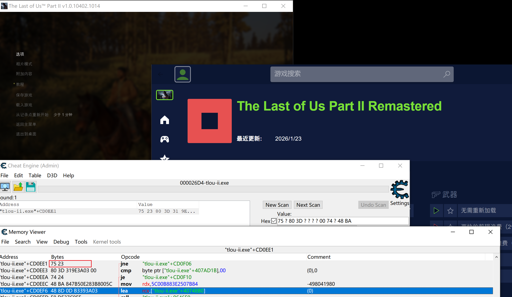

运行游戏，运行exe，游戏内存没能修改成功。

很可能是异常的问题。

## 有一个线程一直抛异常
```
00000216CE2E2538                 | 41:B8 32000000           | mov r8d,32                                 | 32:'2'
00000216CE2E253E                 | 48:8D9424 00200000       | lea rdx,qword ptr ss:[rsp+2000]            | [rsp+2000]:L"aobscanmodule(stamina,tlou-ii.exe,75 ? 80 3D ? ? ? ? 00 74 ? 48 BA)"
00000216CE2E2546                 | 48:8D8C24 40180000       | lea rcx,qword ptr ss:[rsp+1840]            |
00000216CE2E254E                 | E8 1D65FFFF              | call 216CE2D8A70                           |
00000216CE2E2553                 | 48:8D15 86390500         | lea rdx,qword ptr ds:[216CE335EE0]         |
00000216CE2E255A                 | 48:8D8C24 40180000       | lea rcx,qword ptr ss:[rsp+1840]            |
00000216CE2E2562                 | E8 074E0200              | call <JMP.&_CxxThrowException>             |


00007FF96F70F2FC                 | 48:895C24 18             | mov qword ptr ss:[rsp+18],rbx              |
00007FF96F70F301                 | 48:897424 20             | mov qword ptr ss:[rsp+20],rsi              |
00007FF96F70F306                 | 48:895424 10             | mov qword ptr ss:[rsp+10],rdx              |
00007FF96F70F30B                 | 57                       | push rdi                                   |
00007FF96F70F30C                 | 48:81EC E0000000         | sub rsp,E0                                 |
00007FF96F70F313                 | 48:8B05 F6510800         | mov rax,qword ptr ds:[7FF96F794510]        |
00007FF96F70F31A                 | 48:33C4                  | xor rax,rsp                                |
00007FF96F70F31D                 | 48:898424 D0000000       | mov qword ptr ss:[rsp+D0],rax              |
00007FF96F70F325                 | 41:8BF0                  | mov esi,r8d                                |
00007FF96F70F328                 | 48:8BFA                  | mov rdi,rdx                                |
00007FF96F70F32B                 | 8BD9                     | mov ebx,ecx                                |
00007FF96F70F32D                 | 894C24 20                | mov dword ptr ss:[rsp+20],ecx              |
00007FF96F70F331                 | E8 FAFEFFFF              | call ntdll.7FF96F70F230                    |
00007FF96F70F336                 | 84C0                     | test al,al                                 |
00007FF96F70F338                 | 74 27                    | je ntdll.7FF96F70F361                      |
00007FF96F70F33A                 | 44:8BC9                  | mov r9d,ecx                                |
00007FF96F70F33D                 | 4C:8D05 DCF00300         | lea r8,qword ptr ds:[7FF96F74E420]         | 00007FF96F74E420:"Critical error detected %lx\n"
00007FF96F70F344                 | 33D2                     | xor edx,edx                                |
00007FF96F70F346                 | 8D4A 65                  | lea ecx,qword ptr ds:[rdx+65]              |
00007FF96F70F349                 | E8 0221F5FF              | call <ntdll.DbgPrintEx>                    |
00007FF96F70F34E                 | 85F6                     | test esi,esi                               |
00007FF96F70F350                 | 74 0F                    | je ntdll.7FF96F70F361                      |
00007FF96F70F352                 | CC                       | int3                                       |
00007FF96F70F353                 | EB 0C                    | jmp ntdll.7FF96F70F361                     |
00007FF96F70F355                 | 48:8BBC24 F8000000       | mov rdi,qword ptr ss:[rsp+F8]              |
00007FF96F70F35D                 | 8B5C24 20                | mov ebx,dword ptr ss:[rsp+20]              |
00007FF96F70F361                 | 895C24 30                | mov dword ptr ss:[rsp+30],ebx              |
00007FF96F70F365                 | B9 01000000              | mov ecx,1                                  |
00007FF96F70F36A                 | 894C24 34                | mov dword ptr ss:[rsp+34],ecx              |
00007FF96F70F36E                 | 48:836424 38 00          | and qword ptr ss:[rsp+38],0                |
00007FF96F70F374                 | 48:8D05 552DF5FF         | lea rax,qword ptr ds:[<RtlRaiseException>] |
00007FF96F70F37B                 | 48:894424 40             | mov qword ptr ss:[rsp+40],rax              |
00007FF96F70F380                 | 894C24 48                | mov dword ptr ss:[rsp+48],ecx              |
00007FF96F70F384                 | 48:897C24 50             | mov qword ptr ss:[rsp+50],rdi              | [rsp+50]:_wctype+172F8
```

```
00000216CE209E0D                 | 48:8D4D 10               | lea rcx,qword ptr ss:[rbp+10]              | [rbp+10]:L"\n\n[ENABLE]\n\naobscanmodule(stamina,tlou-ii.exe,75 ? 80 3D ? ? ? ? 00 74 ? 48 BA) \n\nstamina:\n  db EB\nregistersymbol(stamina)\n\n[DISABLE]\n\nstamina:\n  db 75\nunregistersymbol(stamina)\n\n\n\n"
00000216CE209E11                 | E8 BAEBFFFF              | call 216CE2089D0                           |
00000216CE209E16                 | 48:8B4C24 38             | mov rcx,qword ptr ss:[rsp+38]              |
00000216CE209E1B                 | 48:8B7C24 30             | mov rdi,qword ptr ss:[rsp+30]              |
00000216CE209E20                 | 48:2BCF                  | sub rcx,rdi                                |
00000216CE209E23                 | 33C0                     | xor eax,eax                                |
00000216CE209E25                 | F3:AA                    | rep stosb                                  | 这个执行后第一个明文buffer被清零了
00000216CE209E27                 | 48:8D45 10               | lea rax,qword ptr ss:[rbp+10]              | [rbp+10]:L"\n\n[ENABLE]\n\naobscanmodule(stamina,tlou-ii.exe,75 ? 80 3D ? ? ? ? 00 74 ? 48 BA) \n\nstamina:\n  db EB\nregistersymbol(stamina)\n\n[DISABLE]\n\nstamina:\n  db 75\nunregistersymbol(stamina)\n\n\n\n"
00000216CE209E2B                 | 48:3BF0                  | cmp rsi,rax                                |
```

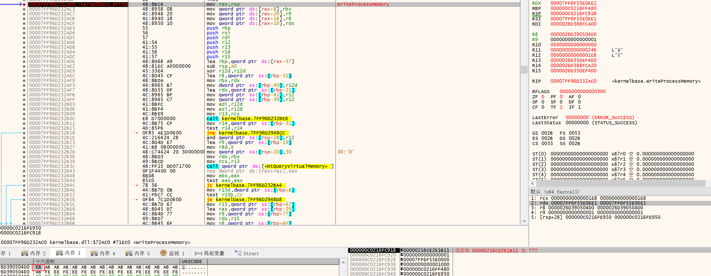

用调试的方式，慢慢执行，真就到WriteProcessMemory了，执行的写入操作恰好就是AA脚本的命令，可见是正确执行了。

执行到返回，看看内存改没改。

用CE查看，那个字节确实改为EB了，修改成功了。但是正常启动exe，会疯狂抛异常，根本就执行不到WriteProcessMemory。难道还有检测？

WriteProcessMemory执行完后，下面的代码会把最后的一块明文清理掉。

```
00000216CE2ED269                 | 8BD0                     | mov edx,eax                                |
00000216CE2ED26B                 | 48:8B8C24 B0020000       | mov rcx,qword ptr ss:[rsp+2B0]             |
00000216CE2ED273                 | 48:03C9                  | add rcx,rcx                                |
00000216CE2ED276                 | 48:8DBC24 A0020000       | lea rdi,qword ptr ss:[rsp+2A0]             |
00000216CE2ED27E                 | 48:83BC24 B8020000 07    | cmp qword ptr ss:[rsp+2B8],7               |
00000216CE2ED287                 | 48:0F47BC24 A0020000     | cmova rdi,qword ptr ss:[rsp+2A0]           |
00000216CE2ED290                 | 33C0                     | xor eax,eax                                |
00000216CE2ED292                 | F3:AA                    | rep stosb                                  | 清理最后的明文
```

这才想到，抛异常的原因，可能是ReadProcessMemory检查游戏内存后抛出的。

果然，ReadProcessMemory断下了。但是aobscan的确会大量扫描。

正常速度运行，就会有一个线程一直抛异常，导致根本就不会执行到WriteProcessMemory。

运行PLITCH测试，发现它也一直抛异常。意识到是因为游戏进程已经被修改了，而又没有还原，再重启修改器进行修改，此时就会一直抛异常。

需要重启游戏进行测试。

## 重启游戏后，再测试
```cpp
    while (true) {
        Sleep(3000);
        // 测试成功了，用CE查看内存，发现被改的那个字节，会在75和E8之间来回切换，说明修改功能已成功生效
        trainer_lib::ExecuteCheat(arg.CheatId, 0);
    }
```

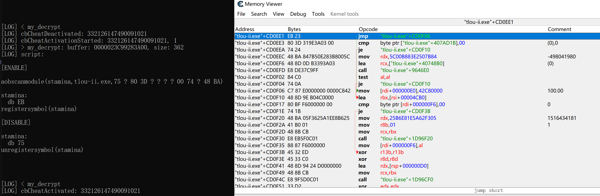

## 尝试实现直接输入明文
它的解密流程是

CryptStringToBinaryW把base64字符串转二进制数组，然后通过一个循环的初步解密，然后才到我hook的最终解密函数。

如果直接输入明文字符串，CryptStringToBinaryW这一步就直接崩溃了。

绕过方式是，仍然给它输入密文，但是在hook的解密函数里把明文替换掉，让它执行我传入的明文。

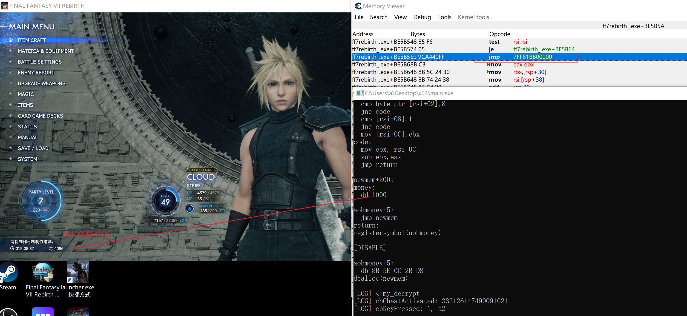

明文调用成功了。


