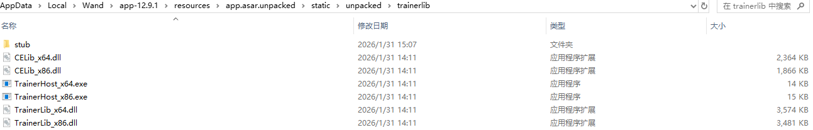
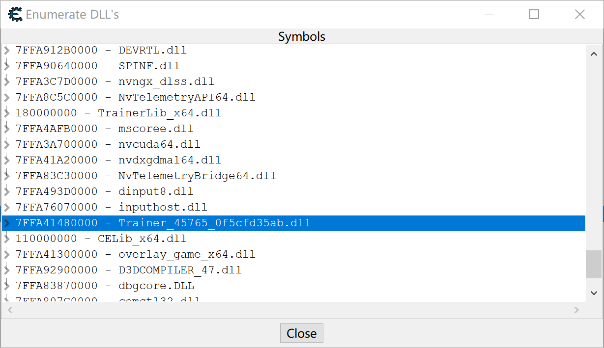
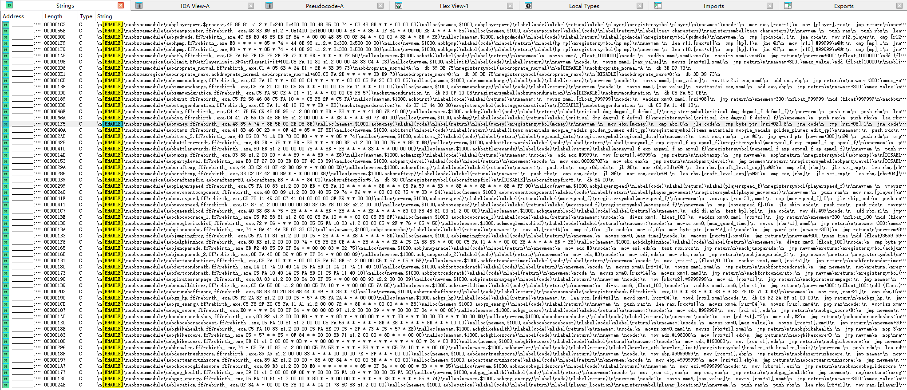

# 2026-01-31
风灵月影是C++和CE AA，零保护，很容易逆向。

WeMod看上去比较复杂，研究一下看看。


它是用electron做的UI。



trainerlib文件夹中的dll应该就是修改器功能的底层实现模块。

CELib_x64.dll和TrainerLib_x64.dll拖入IDA，发现都有静态混淆，字符串混淆，代码大概率有加壳。

这两个dll被重点保护，说明就是功能核心实现模块。

运行游戏，测试WeMod对FF7Rebirth的功能是正常生效的。

用CE打开所有Wand.exe进程，都没有在模块列表中找到CELib_x64.dll和TrainerLib_x64.dll，所以应该是注入到游戏进程了。

用CE打开游戏进程，查看模块列表，果然。

CELib_x64.dll和TrainerLib_x64.dll，以及overlay_game_x64.dll都出现在了游戏进程中。

有一个特殊的dll "7FFA41480000 - Trainer_45765_0f5cfd35ab.dll"，这大概率就是FF7Rebirth这个游戏特有的修改器功能实现的dll。



在Wand根目录搜索"Trainer_45765_0f5cfd35ab.dll"，找不到这个文件，可见是动态生成后注入到游戏的，可能是从网络下载，也可能是解压或脱壳后生成的。

用x64dbg附加游戏进程，Scally导出模块，看到那个dll实际上在"AppData\Roaming\Wand\App\trainers"这个目录下。

应该是按需从网络下载下来的。

Scally导出dll到磁盘，拖入IDA，发现字符串已经是明文了，说明只是一个静态加密壳，运行时就还原为明文了，没有难度。

字符串搜索"[ENABLE]"，就可以看到所有CE AA脚本代码了。



## 和风灵月影一模一样
```cpp
  v1 = "\n"
       "[ENABLE]\n"
       "aobscanmodule(aobmoney,ff7rebirth_.exe,48 85 * 74 * 8B 5E 0C 2B D8 8B)\n"
       "alloc(newmem,$1000,aobmoney)\n"
       "label(code)\n"
       "label(return)\n"
       "label(money)\n"
       "registersymbol(money)\n"
       "\n"
       "newmem:\n"
       "  mov ebx,[money]\n"
       "  cmp ebx,0\n"
       "  jle code\n"
       "  cmp byte ptr [rsi+02],8\n"
       "  jne code\n"
       "  cmp [rsi+08],1\n"
       "  jne code\n"
       "  mov [rsi+0C],ebx\n"
       "code:\n"
       "  mov ebx,[rsi+0C]\n"
       "  sub ebx,eax\n"
       "  jmp return\n"
       "\n"
       "newmem+200:\n"
       "money:\n"
       "dd 0\n"
       "\n"
       "aobmoney+5:\n"
       "  jmp newmem\n"
       "return:\n"
       "registersymbol(aobmoney)\n"
       "\n"
       "[DISABLE]\n"
       "aobmoney+5:\n"
       "  db 8B 5E 0C 2B D8\n"
       "dealloc(newmem)\n";
```
```cpp
  v1 = "\n"
       "[ENABLE]\n"
       "aobscanmodule(aobhpmp,ff7rebirth_.exe,E8 * * * * * 85 * 74 * 44 8B 90 s1.2.*.0x300.0x500 00 00)\n"
       "alloc(newmem,$1000,aobhpmp)\n"
       "label(code)\n"
       "label(return)\n"
       "label(hp mp)\n"
       "registersymbol(hp mp)\n"
       "\n"
       "newmem:\n"
       "  lea r10,[rax+s1]\n"
       "  cmp [hp],1\n"
       "  jne @f\n"
       "  mov [r10],#99999\n"
       "@@:\n"
       "  cmp [mp],1\n"
       "  jne @f\n"
       "  mov [r10+04],#9999\n"
       "code:\n"
       "  mov r10d,[r10]\n"
       "  jmp return\n"
       "\n"
       "newmem+200:\n"
       "hp:\n"
       "dd 0\n"
       "mp:\n"
       "dd 0\n"
       "\n"
       "aobhpmp+A:\n"
       "  jmp newmem\n"
       "  nop 2\n"
       "return:\n"
       "registersymbol(aobhpmp)\n"
       "\n"
       "[DISABLE]\n"
       "aobhpmp+A:\n"
       "  db 44 8B 90 s1 00 00\n"
       "dealloc(newmem)\n";
```
看一眼这熟悉的aobmoney和aobhpmp，和风灵月影的代码一个字都不差，哈哈哈，这小子也是抄袭的，实锤了。

